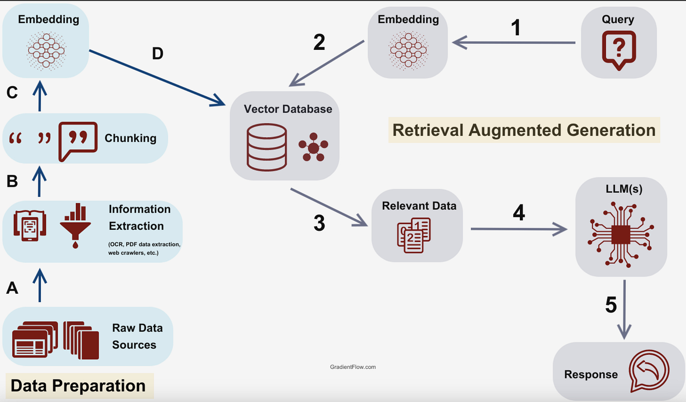
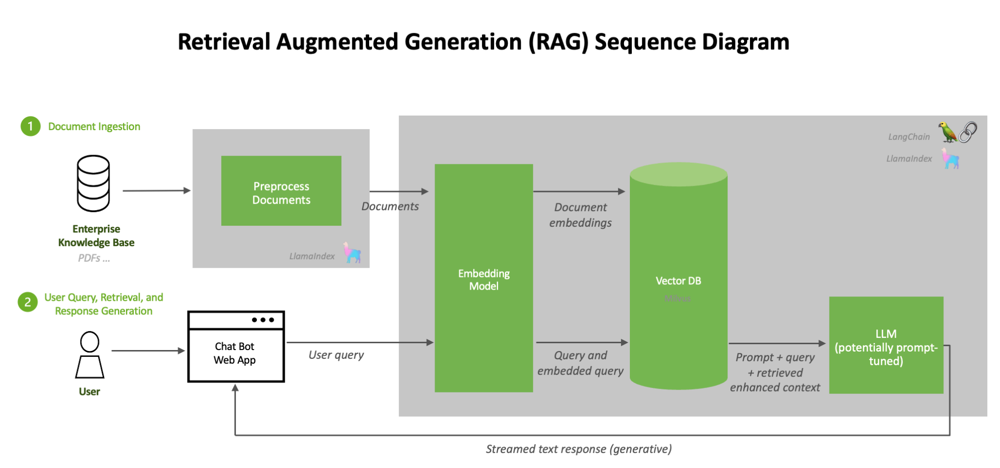

# Comprehensive Guide to Retrieval-Augmented Generation (RAG) in 2026

## Introduction to Retrieval-Augmented Generation (RAG)

Retrieval-Augmented Generation (RAG) represents a powerful AI paradigm that combines the generative capabilities of large language models (LLMs) with external retrieval systems. Rather than relying solely on the fixed knowledge embedded within an LLM's parameters, RAG architectures dynamically fetch relevant data from dedicated knowledge bases, databases, or document corpora at inference time. This hybrid approach consists primarily of two components: (1) a retrieval module that identifies and fetches pertinent documents or information snippets based on the input query, and (2) a generative model that conditions on both the query and retrieved context to produce accurate, informed responses[^1][^2].

One of the key motivations behind RAG is its ability to mitigate hallucinations--instances where LLMs generate plausible but incorrect or fabricated information. By grounding generation in externally retrieved data, RAG systems significantly improve factual accuracy and trustworthiness, which is critical for enterprise and mission-critical applications in 2026. Additionally, RAG facilitates domain adaptation without the costly and time-consuming need to retrain massive models. Instead, updating or expanding the retrieval knowledge source enables models to serve new use cases or fresh data with minimal effort[^1][^3].

Since its inception, RAG has evolved substantially. Early models relied on simpler retrieval and fusion techniques, whereas state-of-the-art 2026 RAG architectures employ dense embeddings, sophisticated retrieval algorithms such as approximate nearest neighbor search, multi-stage re-ranking, and optimized prompt design. This evolution has made RAG a cornerstone approach in enterprise AI, where integrating real-time, contextual knowledge is essential for scalability and performance[^3][^4].

Understanding RAG requires familiarity with several foundational terms. *Embeddings* are vector representations of text that enable efficient similarity search during retrieval. *Retrieval* refers to selecting relevant documents or information fragments from large external corpora. *Re-ranking* involves ordering retrieved documents by relevance before generating a response. Finally, *prompt design* is the art of crafting input templates that guide the LLM to effectively incorporate retrieved content in generation[^2][^5].

This introduction sets the stage for deeper dives into the inner workings of RAG architectures, best practices for building retrieval pipelines, and practical deployment strategies. By mastering these concepts, AI developers and product teams can harness RAG's ability to bridge large-scale knowledge with generative intelligence, unlocking new frontiers of reliable and adaptable AI-powered applications in 2026.


*Overview diagram illustrating the two core components of a Retrieval-Augmented Generation system: retrieval module and generative model.*

## Core Architecture of RAG Systems in 2026

Modern Retrieval-Augmented Generation (RAG) systems in 2026 integrate advanced retrieval and generation modules to produce accurate, contextually grounded responses. At their core, these architectures follow a multi-stage pipeline designed to efficiently handle vast knowledge sources while maintaining low latency and high relevance.

### Typical Pipeline Overview

The canonical RAG pipeline begins with **query embedding**, where the user's input question or prompt is transformed into a dense vector representation using state-of-the-art embedding models. This embedding then drives **vector search** over a large-scale document index, often powered by Approximate Nearest Neighbor (ANN) algorithms, to retrieve candidate documents relevant to the query.

Following retrieval is a **re-ranking** step, which refines the initial candidate list by scoring documents with more nuanced models that consider semantic, syntactic, and contextual relevance. Finally, the **generation** module--often a large language model (LLM) fine-tuned to condition on retrieved documents--produces a coherent, informed output grounded explicitly in the fetched knowledge [Source](https://verysell.ai/retrieval-augmented-generation-best-knowledge-for-2026).

### Enhancements: Multi-hop Retrieval and Graph-Augmented Methods

Contemporary RAG architectures advance beyond single-step retrieval by employing **multi-hop retrieval**, allowing the system to iteratively gather related information across linked documents or knowledge bases. This mimics human-like reasoning, where answers require synthesizing facts dispersed over multiple sources.

Further, **graph-augmented methods** embed knowledge into structured graph representations, leveraging entities and their relations to guide retrieval. Such approaches provide richer semantic context, enabling more precise document selection for complex queries. Incorporating these graphs directly into generation architectures fosters deeper factual grounding and explanation capabilities.

Additionally, **agentic architectures** that orchestrate multiple specialized retriever and generator components have emerged. These systems dynamically decide retrieval strategies and generation styles based on query complexity and domain, boosting performance across diverse tasks [Source](https://www.techment.com/blogs/rag-in-2026).

### Multimodality and Multilingualism Handling

The latest RAG frameworks embrace **multimodality**, combining textual retrieval with images, audio, and structured data to respond to richer queries. Vector search indexes and generation models now natively support embedding and conditioning across modalities, unlocking applications like document + image question answering or video summarization.

Similarly, robust **multilingual RAG setups** employ cross-lingual embeddings and translation-augmented retrieval to serve global user bases without sacrificing contextual fidelity. These systems dynamically detect query languages and leverage multilingual corpora and generation models trained on diverse languages, ensuring relevance and factuality in outputs across linguistic boundaries [Source](https://squirro.com/squirro-blog/state-of-rag-genai).

### Example Architecture Flow

A typical 2026 RAG architecture might look like this:

1. **User Query** 

2. **Query Embedder** (multimodal/multilingual) 

3. **Vector Search Engine** (ANN over dense document indexes, possibly graph-augmented) 

4. **Re-ranker** (learned ranker with cross-document context) 

5. **Document Selector** (top-K documents) 

6. **Generator** (LLM conditioned on the selected documents + query) 

7. **Answer Output**

This flow supports extensibility layers for multi-hop retrieval or agentic decision-making modules controlling retrieval strategy [Source](https://dev.to/suraj_khaitan_f893c243958/-rag-in-2026-a-practical-blueprint-for-retrieval-augmented-generation-16pp).

### Cutting-Edge Techniques for Accuracy, Latency, and Cost

To enhance **accuracy**, recent RAG systems integrate external knowledge graphs and leverage neural re-ranking models trained on diverse domains. Techniques like iterative verification and consistency checking across generated outputs further improve factual correctness.

For **latency reduction**, lightweight retrievers paired with quantized or distilled language models enable fast responses without large compute overhead. Cache-aware retrieval and on-device vector search also reduce round-trip times and cloud costs.

Regarding **cost**, hybrid architectures that balance sparse and dense retrieval approaches optimize infrastructure usage. Adaptive retrieval depth and selective generation invocation save compute when query complexity is low.

In sum, the core RAG architecture in 2026 is a sophisticated orchestration of embedding, retrieval, and generation components enhanced with multi-hop, graph, multimodal, and multilingual capabilities -- all optimized for enterprise-scale AI applications [Source](https://www.linkedin.com/pulse/complete-2026-guide-modern-rag-architectures-how-retrieval-pathan-rx1nf), [Source](https://www.techment.com/blogs/rag-architectures-enterprise-use-cases-2026).


*Flowchart depicting the typical pipeline stages in a modern RAG architecture: user query input, query embedding, vector search, re-ranking, document selection, generation, and output.*

## Current RAG Techniques and Variants in 2026

Retrieval-Augmented Generation (RAG) in 2026 has evolved far beyond its original, naive implementations. Basic RAG models traditionally combine a retrieval component--fetching relevant documents from a static index--with a generative model that produces responses based on retrieved information. While effective, these naive methods often suffer from limited context understanding and static retrieval paths. Today's advanced RAG methods incorporate agentic behaviors, graph-based hybrid approaches, and dynamic architectures that enhance reasoning, context integration, and adaptability [Source](https://verysell.ai/retrieval-augmented-generation-best-knowledge-for-2026).

### Naive vs. Advanced RAG Methods

Naive RAG involves a simple retrieve-and-generate pipeline, where document retrieval is typically single-hop and fixed. More advanced forms include:

- **Agentic RAG:** These systems employ autonomous agents that iteratively query external knowledge bases or APIs, dynamically updating retrieval strategies during generation. This supports flexible reasoning pathways and better handling of ambiguous queries.

- **Graph-Based Hybrid RAG:** By integrating knowledge graphs with retrieval, these variants enable multi-hop reasoning, where the system traverses nodes and edges to connect disparate facts before generation, improving answer precision [Source](https://www.techment.com/blogs/rag-in-2026).

### RAG Patterns: Multi-Hop, Streaming, Retrieval-Memory, Chain-of-Retrieval

Several specialized RAG patterns have gained adoption:

- **Multi-Hop Retrieval:** The model retrieves documents across multiple related queries, piecing together information stepwise. For example, a medical AI assistant might first retrieve symptoms, then relevant diseases, and finally therapeutic guidelines, synthesizing answers with greater depth.

- **Streaming RAG:** This pattern is designed for real-time environments where documents stream continuously (e.g., news feeds). The system incrementally updates retrieval indices and adapts outputs on-the-fly, crucial for time-sensitive use cases.

- **Retrieval-Memory RAG:** Incorporates long-term memory caches that maintain updated knowledge states from prior interactions, enabling personalized or contextually coherent responses over time.

- **Chain-of-Retrieval:** Combines retrieval steps in ordered chains akin to chain-of-thought prompting, ensuring each fetched document informs the next retrieval, culminating in comprehensive answers [Source](https://dev.to/suraj_khaitan_f893c243958/-rag-in-2026-a-practical-blueprint-for-retrieval-augmented-generation-16pp).

### Security and Bias-Reduction in RAG

Given RAG's reliance on external data, security concerns such as data leakage, adversarial manipulation, and privacy risks are paramount. Modern RAG pipelines incorporate:

- **Access Control & Encryption:** Ensuring retrieval sources comply with enterprise security standards and encrypting communication channels.

- **Content Filtering:** Pre-retrieval and post-generation filtering remove malicious or inappropriate content, aided by machine learning classifiers.

- **Bias Mitigation:** Applying algorithmic fairness techniques both in retrieval ranking and generation phases helps reduce propagating biases from skewed training or source data. Some systems integrate adversarial debiasing or differential privacy mechanisms tailored for RAG workflows [Source](https://squirro.com/squirro-blog/state-of-rag-genai).

### Enterprise AI Applications Benefiting from RAG Variants

Enterprises leverage RAG across domains, selecting variants suited for specific needs:

- **Customer Support:** Multi-hop RAG with retrieval-memory enables personalized and context-aware assistance exceeding simple FAQ answering.

- **Compliance & Risk Management:** Graph-based RAG helps navigate complex regulatory relationships and audit trails.

- **Knowledge Management:** Streaming RAG supports continuously updated intranet or industry news summarization.

- **Productivity Tools:** Chain-of-retrieval architectures power decision-support systems that integrate multiple data silos and document types [Source](https://www.techment.com/blogs/rag-architectures-enterprise-use-cases-2026).

### Meeting Real-Time and Personalization Demands

RAG's modular combination of retrieval and generation naturally addresses real-time knowledge updates. Streaming and retrieval-memory methods empower systems to serve personalized results reflecting recent user interactions and evolving domains. This adaptability mitigates the problem of static, outdated generative AI knowledge bases, making RAG a cornerstone for future-proof AI applications.

By understanding these sophisticated RAG techniques and how they address security, bias, and contextual relevance, AI practitioners can design systems that are both powerful and responsible, tailored for cutting-edge enterprise deployments in 2026. 

---

*For a comprehensive breakdown of RAG architectures and practical frameworks available today, consider exploring:*  
- [Retrieval Augmented Generation (RAG) Best Knowledge for 2026](https://verysell.ai/retrieval-augmented-generation-best-knowledge-for-2026)  
- [RAG in 2026: How Retrieval-Augmented Generation Works for Enterprise AI](https://www.techment.com/blogs/rag-in-2026)  
- [RAG in 2026: A Practical Blueprint for Retrieval-Augmented Generation](https://dev.to/suraj_khaitan_f893c243958/-rag-in-2026-a-practical-blueprint-for-retrieval-augmented-generation-16pp)

## Building a Robust RAG Pipeline from Scratch

Developing an efficient Retrieval-Augmented Generation (RAG) system requires careful orchestration of multiple components, from data preparation to continuous monitoring. This section guides you through practical steps and best practices to build a scalable and high-performing RAG pipeline in 2026.

### Data Ingestion and Chunking Strategies

Effective data ingestion starts with selecting diverse and relevant data sources--structured databases, documents, web pages, or internal knowledge bases. The key to optimizing retrieval quality lies in smart chunking: breaking large documents into semantically meaningful pieces that balance granularity and context.

- **Chunk Size:** Aim for chunks of 300-500 tokens to retain context without overwhelming retrieval models.
- **Overlap:** Use a small overlap (e.g., 50 tokens) to prevent losing continuity between chunks.
- **Semantic Chunking:** Consider NLP-based chunking techniques, such as sentence embedding similarity, to split content along natural boundaries rather than fixed lengths.

These strategies ensure that the retriever can accurately match queries with relevant portions of data, improving downstream generation.[Source](https://verysell.ai/retrieval-augmented-generation-best-knowledge-for-2026)

### Embedding Generation and Vector Database Selection

Next, generate dense vector representations for each chunk using state-of-the-art embedding models. By 2026, fine-tuned transformer-based encoders (e.g., OpenAI's ada embedding or similar open models) are the backbone of effective embeddings.

Consider these best practices:

- **Embedding Model Choice:** Opt for task-specific fine-tuning on your domain for maximum accuracy.
- **Vector Database:** Choose databases optimized for fast approximate nearest neighbor (ANN) search with scalability in mind--such as FAISS, Pinecone, or Weaviate.
- **Indexing:** Use hierarchical or hybrid indices to balance recall and latency.

Here is a minimal Python snippet illustrating embedding and vector indexing with FAISS:

```python
import faiss
import numpy as np

# Assume embeddings is a NumPy array of shape (num_chunks, embedding_dim)
embedding_dim = 768
index = faiss.IndexFlatL2(embedding_dim)
index.add(embeddings)  # Add chunk embeddings to index

# Query embedding example
query_embedding = embed_query("What is RAG?")
_, indices = index.search(np.array([query_embedding]), k=5)  # Retrieve top 5 chunks
```

### Document Retrieval Workflow: Hybrid Search and Re-ranking

The retrieval phase advances beyond simple semantic search. Hybrid search, combining lexical matching (e.g., BM25) with vector similarity, captures both keyword relevance and semantic intent. This approach is standard in 2026 for robust retrieval, especially in enterprise settings.

After initial retrieval, re-ranking with cross-encoders or lightweight rankers refines result quality by scoring the union of query and candidate texts more accurately. This step mitigates noise and improves generation input.

A typical flow:

1. Perform hybrid search to retrieve candidate chunks.
2. Apply a fine-tuned cross-encoder model to re-rank candidates.
3. Pass top-ranked chunks to the generative model.

### Prompt Engineering Essentials

Well-crafted prompts are vital for maximizing the relevance and coherence of the generated output. Essentials include:

- **Context Injection:** Concatenate retrieved chunk text strategically ahead of the prompt to provide factual grounding.
- **Instruction Clarity:** Use explicit instructions and examples to guide generation style and factuality.
- **Length Control:** Limit prompt size to fit model input constraints while preserving key information.

Experimentation with prompt templates and few-shot exemplars remains a critical iterative process.[Source](https://dev.to/suraj_khaitan_f893c243958/-rag-in-2026-a-practical-blueprint-for-retrieval-augmented-generation-16pp)

### Evaluation Metrics and Continuous Monitoring

Building a robust RAG pipeline demands ongoing evaluation and monitoring:

- **Metrics:** Use recall@k, precision, mean reciprocal rank (MRR) for retrieval; BLEU, ROUGE, and human evaluation for generation relevance.
- **A/B Testing:** Run comparative tests to validate changes in indexing, retrieval, or prompting.
- **Drift Detection:** Implement alerts for data or model drift to schedule retraining or re-indexing.

Automated pipelines integrated with monitoring dashboards facilitate proactive quality assurance and performance tuning.[Source](https://www.kapa.ai/blog/how-to-build-a-rag-pipeline-from-scratch-in-2026)

### Open-Source Frameworks for RAG Development

To accelerate pipeline development, leverage leading open-source frameworks:

- **Haystack:** Offers modular components for indexing, retrieval, and generation with extensive customization.
- **LangChain:** Enables chaining of multiple LLM operations including retrieval, supported by diverse data connectors.
- **RAG-Framework-2026:** A new Google-led initiative focusing on scalability and optimized hybrid search ([Source](https://discuss.ai.google.dev/t/building-a-better-rag-pipeline-introducing-the-open-source-rag-framework-2026/169161)).

These frameworks include production-ready integrations and exemplary pipelines, helping developers focus on domain-specific refinements rather than reinventing core functionality.

---

By combining principled chunking, optimized embedding and retrieval, precise prompting, and diligent monitoring, you can architect a RAG pipeline that delivers accurate, context-rich AI outputs at scale. Embracing the open-source ecosystem further accelerates deployment and innovation in this rapidly evolving field.

## Top RAG Frameworks and Tools for 2026

As Retrieval-Augmented Generation (RAG) continues to evolve as a transformative AI paradigm in 2026, several frameworks have emerged as leaders in accelerating RAG development and deployment. Among the most popular are **LangChain**, **LlamaIndex**, and the newly introduced open-source **RAG Framework 2026**. Each offers a unique blend of capabilities tailored for different project requirements, from rapid prototyping to enterprise-grade systems. 

### Popular Frameworks Overview

- **LangChain** is widely appreciated for its modular design that seamlessly integrates various retrieval components with large language models (LLMs). It excels in orchestration, enabling developers to build custom pipelines with high retrieval accuracy. Its enterprise features include robust logging, asynchronous execution, and flexible connectors to popular vector databases such as Pinecone and Weaviate.

- **LlamaIndex** (formerly GPT Index) focuses on simplifying interactions between LLMs and external data sources by providing efficient data structuring and indexing mechanisms. Its strengths lie in retrieval precision, adaptability to diverse backend databases, and ease of extending retrieval strategies, making it ideal for projects that require deep domain-specific knowledge integration.

- The **open-source RAG Framework 2026** has recently gained traction for combining cutting-edge retrieval algorithms with native support for a broad spectrum of LLMs, including both open and closed models. It emphasizes scalability and production reliability, offering out-of-the-box enterprise readiness with support for distributed retrieval and federated search across multiple data silos.

### Strengths and Compatibility

All these frameworks share core strengths:

- **Retrieval Accuracy**: Advanced vector similarity search and hybrid search techniques improve the relevance of retrieved documents.
- **Orchestration and Modularity**: They offer plug-and-play components that allow developers to tailor pipelines specific to their RAG use cases.
- **Enterprise Readiness**: Features like role-based access controls, audit trails, and monitoring integrations ensure compliance and operational stability.
- **Compatibility**: These tools maintain broad compatibility with popular LLMs such as GPT-4, Claude, and open models like LLaMA and Mistral, alongside smooth backend integration with databases like Elasticsearch, Milvus, and Redis.

### Community, Extensibility, and Reliability

Community support continues to be a vital consideration:

- **LangChain** boasts a vibrant developer community, extensive documentation, and frequent updates, facilitating rapid troubleshooting and feature expansion.
- **LlamaIndex** benefits from active contributions focusing on enhanced retrieval indexes and seamless incorporation of proprietary data sources.
- The **RAG Framework 2026** stands out for its open governance model, encouraging extensibility through plugin architectures and community-driven connectors.

All three are battle-tested in production environments, underpinning critical AI services across sectors such as finance, legal, and healthcare, with proven reliability in high-throughput scenarios.

### Recommendations for Choosing the Right Tool

- For **small to medium projects or fast prototyping**, LangChain's rich ecosystem and ease of integration make it the go-to framework.
- When **precision and custom indexing** of niche data domains are paramount, LlamaIndex offers the best tools to build specialized retrieval structures.
- Enterprises aiming for **robust scalability and federated retrieval** across large heterogeneous datasets should consider the open-source RAG Framework 2026 due to its cutting-edge architectural design and production-grade features.

By aligning tool choice with project scale, data complexity, and performance needs, developers and product managers can significantly accelerate their RAG implementations while ensuring maintainability and future-proofing.

For a detailed comparison and updated insights on RAG frameworks in 2026, see the comprehensive analyses available at [VerySell AI](https://verysell.ai/retrieval-augmented-generation-best-knowledge-for-2026) and [TechMent](https://www.techment.com/blogs/rag-in-2026) [Source](https://verysell.ai/retrieval-augmented-generation-best-knowledge-for-2026).

## Practical Tips for Deployment, Scaling, and Governance in RAG Systems

Retrieval-Augmented Generation (RAG) systems have become foundational in enterprise AI workflows by combining the power of large language models with external knowledge retrieval. However, operationalizing RAG at scale--especially in regulated industries--presents unique challenges that require deliberate strategies for deployment, governance, and cost efficiency. Below are key best practices distilled from the latest 2026 research and industry insights.

### Scaling RAG for Enterprise Workloads and Regulated Data

Large-scale deployment of RAG systems requires balancing retrieval latency, throughput, and data compliance constraints. Enterprises handling regulated data--such as healthcare, finance, or government--must ensure secure data storage and retrieval, often necessitating on-premises or private cloud infrastructure to control data sovereignty. Additionally, implementing smart caching layers can reduce retrieval bottlenecks while ensuring that frequently accessed documents adhere to compliance rules. Distributing retrieval indexes geographically closer to end-users or using hybrid setups that combine local and cloud-based indexes can mitigate latency and bandwidth constraints common in global enterprises [Source](https://www.techment.com/blogs/rag-in-2026).

### Governance Strategies for Explainability and Responsible AI

RAG systems integrate multiple components (retriever, generator, knowledge base), which complicates traceability. To maintain explainability, it is crucial to log provenance data--tracking which documents were retrieved and how they influenced generated responses. This auditable trail supports compliance with regulations like GDPR and AI ethics frameworks, allowing enterprises to detect and correct hallucinations or biases in generated outputs.

Responsible AI practices also advocate for human-in-the-loop validation, especially when deploying RAG in high-stakes domains. Governance frameworks should define clear roles for monitoring model behavior and include policies for data refresh cycles, model retraining, and controlled update rollouts, ensuring that retrieval and generation components remain aligned with the latest regulations and organizational standards [Source](https://squirro.com/squirro-blog/state-of-rag-genai).

### Cost Control and Latency Optimization

RAG workflows potentially run inference over two stages--retrieval and generation--making them more resource-intensive than standalone LLM applications. Cost control starts with efficient retriever selection: dense vector search models are powerful but require costly GPU hardware for realtime search. Hybrid retrieval methods that combine sparse indexing and lightweight rerankers can balance cost and accuracy.

Latency can be optimized by asynchronous retrieval pipelines where fetching relevant documents overlaps with token generation or by reducing the number of retrieved documents without sacrificing accuracy. Employing distillation or quantized models for retrieval and generation components also reduces compute demands [Source](https://dev.to/suraj_khaitan_f893c243958/-rag-in-2026-a-practical-blueprint-for-retrieval-augmented-generation-16pp).

### Monitoring Frameworks for Model and Retrieval Quality

Continuous monitoring is vital to detect drifts in retrieval relevance and generation quality. Effective monitoring should combine metrics such as retrieval precision/recall, query response time, and generation fluency scores. Alerting mechanisms for drops in relevance or spikes in hallucinations enable timely investigation and retraining.

System monitoring can be enhanced by logging user feedback loops or incorporating periodic human-in-the-loop evaluation in production. This hybrid monitoring approach ensures that both retrieval effectiveness and generated content remain aligned with user expectations and business goals [Source](https://alphacorp.ai/blog/rag-frameworks-top-5-picks-in-2026).

### Handling Multimodal Data and Real-Time Enrichment

Modern RAG systems increasingly integrate multimodal knowledge bases, including images, audio, and video transcripts, expanding use cases such as enterprise search and customer support. Designing retrieval pipelines that normalize and index these diverse data types requires multimodal embeddings and cross-modal retrieval techniques.

For real-time enrichment scenarios--such as dynamic knowledge bases or live data feeds--RAG systems must support incremental index updates without full rebuilds, enabling up-to-the-second freshness. Solutions often involve using vector databases that support partial updates and deploying pipelines optimized for streaming data ingestion.

Incorporating these practical considerations will help organizations deploy RAG that is not only powerful but also scalable, cost-effective, and compliant with evolving enterprise requirements [Source](https://verysell.ai/retrieval-augmented-generation-best-knowledge-for-2026).

## Future Trends and Research Directions for RAG

As Retrieval-Augmented Generation (RAG) systems continue evolving, several key trends and research directions are shaping the technology landscape beyond 2026. Developers and product managers looking to stay ahead must understand these emerging innovations, ongoing challenges, and ethical considerations.

### Advances in Embedding Models and Multimodal Retrieval

The foundation of RAG--the retrieval of relevant information--benefits significantly from progress in embedding models. Cutting-edge embeddings in 2026 are dynamically updated to capture real-time context and better semantic nuance. This enables **real-time dynamic retrieval** where the RAG system adapts instantly to evolving queries or user inputs. Additionally, integration of **multimodal data retrieval**--combining text, images, audio, and video embeddings--extends RAG capabilities to richer knowledge sources beyond pure text corpora [Source](https://verysell.ai/retrieval-augmented-generation-best-knowledge-for-2026).

### Graph Neural Networks and Agentic RAG for Complex Reasoning

Increasingly, research explores the use of **graph neural networks (GNNs)** to model complex relationships within retrieved knowledge graphs. By encoding relational information, GNNs empower RAG to perform more sophisticated, multi-hop reasoning rather than isolated fact retrieval. This fundamentally changes the generation process, enabling **agentic RAG** architectures that plan and reason through retrieval-action cycles, mimicking human-like problem solving [Source](https://aishwaryasrinivasan.substack.com/p/all-you-need-to-know-about-rag-in).

### Ongoing Challenges: Hallucination, Retrieval Quality, and Metrics

Despite advances, **hallucination**--where the model generates plausible but incorrect information--remains a persistent challenge. Researchers focus on improving retrieval precision and integrating grounded knowledge to suppress hallucinated content. Similarly, measuring retrieval quality and overall RAG performance demands **better evaluation metrics** that balance relevance, factuality, and fluency. The community actively experiments with hybrid benchmarks combining automated scoring and human assessment to address this [Source](https://dev.to/suraj_khaitan_f893c243958/-rag-in-2026-a-practical-blueprint-for-retrieval-augmented-generation-16pp).

### Ethical Implications and Bias Mitigation

As RAG systems gain influence in enterprise and public-facing applications, **ethical considerations** are paramount. There is growing emphasis on developing mechanisms for **bias detection and mitigation** within retrieval and generation components. Transparency in data provenance and citation, fairness in knowledge representation, and safeguarding against misinformation are critical research and engineering priorities going forward [Source](https://squirro.com/squirro-blog/state-of-rag-genai).

### Opportunities for Developer Experimentation and Open Source Contributions

The vibrant open-source ecosystem around RAG frameworks invites developers to experiment with new architectures, retrieval sources, and optimization techniques. Contributing to established projects such as the **RAG-Framework-2026** can accelerate innovation and provide production-ready tools. Areas ripe for exploration include multimodal fusion, real-time indexing pipelines, and agentic reasoning modules. Engaging with community benchmarks and workshops ensures that practical advances help shape the next generation of RAG deployments [Source](https://discuss.ai.google.dev/t/building-a-better-rag-pipeline-introducing-the-open-source-rag-framework-2026/169161).

---

By embracing these trends and addressing persistent challenges, AI practitioners can leverage RAG's growing potential to build more intelligent, reliable, and ethical knowledge-driven applications in 2026 and beyond.
