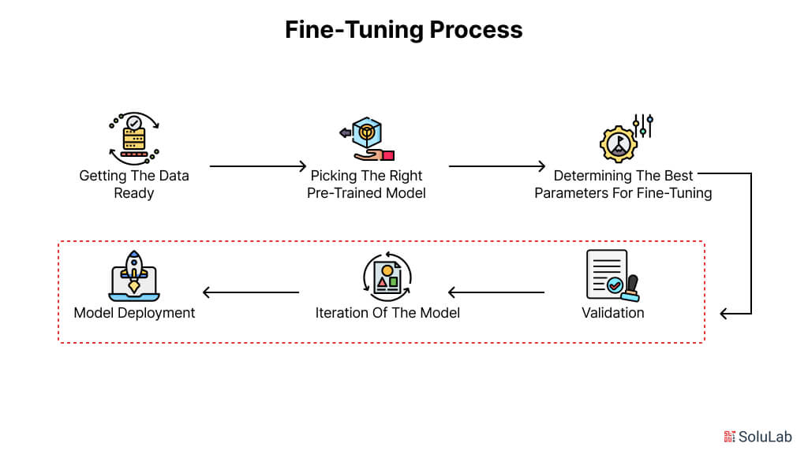
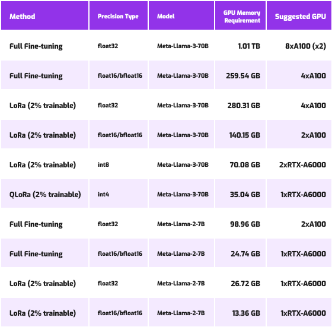

# Mastering Fine-Tuning in 2026: Techniques, Tools, and Best Practices

## Introduction to Fine-Tuning Large Language Models in 2026

Fine-tuning, in the context of large language models (LLMs), refers to the process of adapting a pretrained model to perform well on a specific task or within a particular domain by further training it on task-relevant data. Unlike training models from scratch, fine-tuning leverages the extensive knowledge learned during the initial pretraining phase and refines it to meet specialized needs. This step is crucial because general-purpose LLMs, although powerful, often fall short when applied directly to niche applications such as medical diagnosis, legal document analysis, or domain-specific customer service [Source](https://www.turing.com/resources/finetuning-large-language-models).

The need for fine-tuning arises from the inherent diversity and specificity of real-world tasks. Pretrained LLMs capture broad linguistic patterns and world knowledge but may lack the precision or context awareness required for particular use cases. Fine-tuning enables these models to internalize domain-specific terminology, nuances, and requirements, thereby significantly boosting their accuracy and relevance. This adaptability makes fine-tuning an indispensable technique for AI researchers and ML practitioners aiming to deploy models that exhibit both high performance and contextual understanding [Source](https://www.superannotate.com/blog/llm-fine-tuning).

Over the years leading to 2026, fine-tuning methodologies have evolved substantially. Traditional full fine-tuning--where all parameters are updated--has been augmented by parameter-efficient fine-tuning (PEFT) techniques such as LoRA, QLoRA, and DPO. These approaches enable updating only a fraction of model parameters, drastically reducing computational costs and accelerating training without sacrificing effectiveness. Moreover, the integration of smarter optimization algorithms, mixed-precision training, and better hardware support have collectively streamlined the fine-tuning pipeline [Source](https://futureagi.com/blog/llm-fine-tuning-techniques-i-ii).

The benefits of fine-tuning extend beyond improved task accuracy. By tailoring models to specific tasks, organizations achieve more efficient inference, reduced latency, and often require less downstream data for retraining. This not only improves the user experience but also lowers operational costs. For instance, PEFT methods facilitate faster experimentation cycles, enabling iterative testing of models with minimal resource expenditure [Source](https://www.spheron.network/blog/how-to-fine-tune-llm-2026).

Regarding workflow duration and cost, fine-tuning large-scale LLMs in 2026 can vary widely depending on model size, data volume, and computational setup. On average, PEFT approaches can reduce training times from multiple days to a few hours on state-of-the-art GPUs, with costs dropping proportionally. Cloud-based fine-tuning platforms now offer more accessible pricing models, democratizing the ability to fine-tune large models even for smaller teams. This evolution underscores fine-tuning's role as a practical, scalable step in modern AI development [Source](https://www.spheron.network/blog/how-to-fine-tune-llm-2026).


*Diagram illustrating the fine-tuning process from pretrained model to specialized task adaptation, showing benefits of fine-tuning such as accuracy and efficiency improvement.*

## Types of Fine-Tuning Techniques in 2026

Fine-tuning remains a cornerstone technique to adapt large language models (LLMs) for specialized tasks or domains in 2026. This section covers the main fine-tuning methodologies in practice today, highlighting their characteristics and appropriate scenarios of use.

### Full Fine-Tuning

Full fine-tuning entails updating all the parameters of a pre-trained model using a target dataset. This method is particularly effective when working with large and diverse datasets, where comprehensive model adaptation can yield significant improvements. Because it modifies every weight, full fine-tuning can fully reshape the model's behavior to suit a new domain or task. However, this also means it requires substantial computational resources and memory, often necessitating high-end GPUs or distributed setups. Despite the cost, full fine-tuning remains the go-to for scenarios demanding maximal model flexibility and capacity to absorb vast new knowledge ([Source](https://www.spheron.network/blog/how-to-fine-tune-llm-2026)).

### Parameter-Efficient Fine-Tuning (PEFT)

PEFT techniques update only a small subset of parameters instead of the entire model, drastically reducing training costs and memory footprints without sacrificing much performance. Notable PEFT methods popular in 2026 include:

- **LoRA (Low-Rank Adaptation):** Injects trainable low-rank matrices into transformer layers to effectively modify model behavior with fewer parameters.
- **QLoRA:** Builds on LoRA by quantizing model weights to 4-bit precision for even more efficient adaptation.
- **DoRA and Spectrum:** Emerging alternatives optimizing efficiency and flexibility, targeting different architectural components.

These methods are well-suited for fine-tuning when limited compute budgets or rapid iteration cycles are critical. They enable practitioners to quickly specialize large models on domain-specific tasks with manageable resource usage ([Source](https://futureagi.com/blog/llm-fine-tuning-techniques-i-ii)).

### Sequential Fine-Tuning

Sequential fine-tuning refers to a staged adaptation process starting from broad, general tasks and progressively moving towards more specialized domains. This approach leverages the hierarchical nature of knowledge: first consolidating foundational linguistic and reasoning capabilities, then layering domain-specific nuances.

By fine-tuning in multiple steps, models avoid catastrophic forgetting of earlier training and achieve better final performance on niche tasks. Sequential fine-tuning is commonly used in industrial pipelines where models must smoothly transition from general-purpose assistants to expert advisors in sectors like healthcare or finance ([Source](https://www.turing.com/resources/finetuning-large-language-models)).

### Reinforcement Learning Approaches: RLHF and DPO

Reinforcement learning paradigms have gained prominence in refining LLM outputs according to human preferences. 

- **RLHF (Reinforcement Learning with Human Feedback):** Incorporates explicit human feedback signals into the model's policy optimization, improving alignment with desired qualities such as helpfulness or safety. It combines supervised fine-tuning with policy gradients to further adapt model behavior.
- **Direct Preference Optimization (DPO):** A newer technique directly optimizes model outputs based on human preference comparisons without requiring reward modeling, simplifying training pipelines and enhancing sample efficiency.

These reinforcement methods are especially valuable for fine-tuning LLMs in interactive or safety-critical applications where alignment with nuanced human values is necessary ([Source](https://futureagi.com/blog/llm-fine-tuning-techniques-i-ii)).

### Feature Extraction Approaches

Feature extraction freezes most of the pre-trained model's layers and trains only the final classification or output layers on a new dataset. This strategy drastically reduces training time and compute costs by limiting parameter updates.

While not as adaptable as full fine-tuning, feature extraction is often employed when data or compute resources are scarce. It works well for transfer learning tasks where the existing model's representations are already suitable for the new domain, requiring only minimal readjustment at the output level ([Source](https://cloud.google.com/use-cases/fine-tuning-ai-models)).

---

In summary, the choice among full fine-tuning, PEFT methods, sequential fine-tuning, reinforcement learning adaptations, or feature extraction depends largely on resource constraints, dataset size, and domain complexity. 2026 offers a rich toolkit allowing practitioners to tailor fine-tuning strategies precisely to their project goals and infrastructure.

## Hardware and Cost Considerations for Fine-Tuning in 2026

Fine-tuning large language models (LLMs) in 2026 involves balancing resource availability, cost-efficiency, and task-specific requirements. Understanding hardware needs and expenses associated with various tuning approaches can help practitioners optimize workflows effectively.

### GPU Memory Requirements

Fine-tuning tasks vary widely in their GPU memory demands depending on the model size and the technique used. For small-scale fine-tuning of moderately sized models (e.g., 1-3 billion parameters), GPUs with as little as 5GB of VRAM can suffice. This enables experimentation and iterative tuning on relatively affordable consumer hardware [Source](https://www.spheron.network/blog/how-to-fine-tune-llm-2026).

On the other hand, training Mixture of Experts (MoE) models or larger-scale models often requires GPUs with upwards of 24GB VRAM. Such hardware accommodates the considerable parameter counts and activations involved in full fine-tuning workflows, especially when gradients for all parameters must be stored and updated [Source](https://www.turing.com/resources/finetuning-large-language-models).

### Cost and Time Estimates

Typical fine-tuning projects on cloud platforms or dedicated hardware can range from $20 to $50 per training run, depending on GPU type and cloud provider pricing. These costs apply primarily to small- to medium-scale fine-tuning tasks, often conducted over timeframes of approximately 4 weeks when accounting for hyperparameter tuning and validation cycles [Source](https://www.superannotate.com/blog/llm-fine-tuning).

More extensive projects with larger models and datasets naturally incur higher fees and longer training times, but PEFT methods (parameter-efficient fine-tuning) can help mitigate these expenses.

### Full Fine-Tuning vs. Parameter-Efficient Fine-Tuning (PEFT)

Full fine-tuning updates all model weights, requiring significant GPU memory and compute resources proportionate to the model size. Conversely, PEFT techniques such as LoRA (Low-Rank Adaptation) and QLoRA focus on updating a small subset of parameters or low-rank tensors, dramatically reducing memory usage and training cost without sacrificing performance [Source](https://futureagi.com/blog/llm-fine-tuning-techniques-i-ii).

For example, PEFT can reduce GPU memory consumption by 50% or more and shorten training time, enabling fine-tuning on more accessible hardware setups. This efficiency translates into cost savings and faster experiment turnaround.

### Impact on Memory and Computation

By limiting the number of tunable parameters, PEFT reduces the volume of gradient calculations and storage overhead during backpropagation. This leads to lower VRAM requirements and less demand on GPU compute units, making parameter-efficient approaches ideal for edge devices or limited-resource environments [Source](https://cloud.google.com/use-cases/fine-tuning-ai-models).

### Choosing Optimal Hardware Setups

Selecting hardware depends primarily on the model size and fine-tuning scope:

- For small to mid-sized models (under 5 billion parameters) and exploratory projects, GPUs with 8 to 12 GB VRAM (e.g., Nvidia RTX 3090, A100 40GB subsets) provide a good balance of cost and capability.
- Large-scale fine-tuning or MoE models necessitate GPUs with 24 GB VRAM or more (e.g., Nvidia A100 80GB or H100 variants) to manage full weight updates efficiently.
- When adopting PEFT, researchers can leverage more cost-effective GPUs with around 5-8 GB VRAM while maintaining competitive accuracy.
- Cloud-based GPUs offer flexible scaling but require monitoring to optimize for cost-effectiveness across the tuning lifecycle.

In conclusion, 2026's fine-tuning landscape benefits from parameter-efficient strategies that make high-quality model adaptation feasible across a range of hardware constraints. Prioritizing PEFT methods and aligning hardware choices to model scale can significantly reduce both computational overhead and cost without compromising results.


*Visual table or infographic comparing GPU memory requirements and cost/time estimates for full fine-tuning vs parameter-efficient fine-tuning (PEFT) approaches in 2026.*

## Step-by-Step Guide to Fine-Tuning a Large Language Model

Fine-tuning a large language model (LLM) in 2026 involves a series of deliberate steps designed to adapt a powerful pretrained model to your specific task with efficiency and precision. Below we walk through these essential steps, highlighting current best practices and techniques that balance performance with computational resources.

### 1. Selecting a Suitable Pretrained Base Model

The starting point is choosing a pretrained LLM that closely aligns with your domain or task goals. In 2026, models vary widely--from generalist open-source transformers like LLaMA and Falcon to specialized models trained on biomedical or legal corpora. Consider these factors:

- **Domain relevance:** Pick a model pretrained on data related to your use case.
- **Model size and compute requirements:** Larger models often perform better but require more resources.
- **Licensing and ecosystem:** Open-source models offer flexibility, while commercial APIs may provide ease of use.

For example, if your task is medical text summarization, selecting a biomedical-tuned base model will reduce fine-tuning time and improve results compared to a purely general model.

### 2. Preparing and Curating High-Quality Task-Specific Datasets

Fine-tuning success critically depends on the quality and relevance of your dataset. Key points for 2026:

- **Data quality:** Clean, accurately labeled, and representative data improves fine-tuning effectiveness.
- **Balanced size:** Depending on the base model, datasets can range from a few thousand to hundreds of thousands of samples.
- **Data augmentation:** Techniques such as paraphrasing and synthetic data generation can increase dataset variability without manual labeling.

For instance, for a sentiment analysis task, curate examples covering a balanced spectrum of positive, neutral, and negative sentiments drawn from your target domain.

### 3. Choosing the Fine-Tuning Method: Full vs Parameter-Efficient Fine-Tuning (PEFT)

Resource constraints and performance goals influence whether to apply full fine-tuning or PEFT:

- **Full fine-tuning:** Updates all model parameters. Best when you have ample GPU resources and large datasets, enabling maximal performance gains.
- **PEFT:** Updates only a small subset of parameters using adapters or low-rank approximation methods such as LoRA or QLoRA. PEFT reduces training time, memory, and permits easier deployment without losing much accuracy.

In 2026, PEFT has become ubiquitous for efficient model adaptation, especially when working with very large models or limited hardware budgets.

### 4. Configuring Hyperparameters and Training Strategies

Hyperparameter tuning remains crucial. Typical considerations:

- **Learning rate:** Fine-tuning usually benefits from lower learning rates (e.g., 1e-5 to 5e-5).
- **Batch size:** Larger batch sizes improve gradient estimation but increase memory usage.
- **Number of epochs:** Often fewer epochs are needed than training from scratch--3 to 5 epochs is common.

Regarding training strategies:

- **Supervised learning:** Standard approach using labeled datasets.
- **Reinforcement learning:** Fine-tuning with feedback signals or reward models (e.g., RLHF) for preference alignment or safety.

Properly scheduling learning rate decay and early stopping helps avoid overfitting and improve generalization.

### 5. Running Fine-Tuning Experiments with Monitoring

During fine-tuning, continuous monitoring is vital:

- **Track key metrics:** Loss, accuracy, and domain-specific scores.
- **Validation datasets:** Use held-out data to detect early signs of overfitting.
- **Compute efficiency:** Utilize modern accelerators (e.g., GPUs with tensor cores) and frameworks optimized for sparse updates, especially when using PEFT.

Automated tools and platforms now provide experiment tracking dashboards that integrate seamlessly with training pipelines, making it easier to iterate and optimize.

### 6. Evaluating Model Performance and Adjusting Accordingly

Post fine-tuning evaluation should be comprehensive:

- **Quantitative metrics:** Evaluate on in-domain benchmarks and real-world tasks.
- **Qualitative analysis:** Review generated outputs to detect biases or failure cases.
- **A/B testing:** When deploying, test model variants against current production versions.

Based on evaluation findings, you may revisit dataset preparation, adjust hyperparameters, or try alternative fine-tuning methods. This iterative cycle is key to mastering fine-tuning in 2026.

---

### Practical Example: Fine-Tuning with PEFT Using LoRA

Below is a minimal code snippet illustrating how to apply PEFT with LoRA during fine-tuning, using a popular transformer library:

```python
from transformers import AutoModelForCausalLM, AutoTokenizer, Trainer, TrainingArguments
from peft import LoraConfig, get_peft_model

# Load base model and tokenizer
model_name = "falcon-7b"
model = AutoModelForCausalLM.from_pretrained(model_name)
tokenizer = AutoTokenizer.from_pretrained(model_name)

# Configure LoRA
lora_config = LoraConfig(r=8, lora_alpha=32, target_modules=["q_proj", "v_proj"], lora_dropout=0.1)
model = get_peft_model(model, lora_config)

# Prepare dataset (pseudo-code)
train_dataset = ...  # Your task-specific dataset tokenized

# Training arguments
training_args = TrainingArguments(
    output_dir="./fine_tuned_falcon",
    learning_rate=3e-5,
    num_train_epochs=3,
    per_device_train_batch_size=16,
    evaluation_strategy="steps",
    eval_steps=500,
    logging_steps=100,
    save_steps=1000,
    save_total_limit=2,
)

# Initialize Trainer
trainer = Trainer(
    model=model,
    args=training_args,
    train_dataset=train_dataset,
    eval_dataset=val_dataset,
)

# Run fine-tuning
trainer.train()
```

This snippet demonstrates a streamlined workflow: loading a pretrained model, applying LoRA PEFT, setting up a dataset, configuring training, and running experiments. Such modular practices are recommended for efficient, scalable fine-tuning workflows in 2026.

By following this step-by-step guide, AI researchers and engineers can harness cutting-edge fine-tuning techniques to tailor LLMs effectively, balancing accuracy, compute cost, and deployment constraints.

## Popular Fine-Tuning Platforms and Tools in 2026

As fine-tuning large language models (LLMs) continues to grow in complexity and importance, several platforms and tools have emerged in 2026 to streamline this process for AI researchers and ML engineers. Among the most prominent are SiliconFlow, Hugging Face, and LLaMA-Factory, each offering robust support for diverse fine-tuning techniques tailored to current industry needs.

SiliconFlow provides a comprehensive environment that supports advanced fine-tuning methods such as Low-Rank Adaptation (LoRA), Quantized LoRA (QLoRA), and reinforcement-based tuning approaches. This platform distinguishes itself with powerful data management capabilities, helping teams organize, preprocess, and version datasets with ease. Additionally, SiliconFlow's optimization pipelines automate hyperparameter tuning and training schedules, reducing manual overhead and accelerating model iteration cycles. Notably, it offers scalable deployment tools to transition fine-tuned models from experimentation to production efficiently, accommodating a wide range of compute infrastructures [Source](https://www.siliconflow.com/articles/en/the-best-fine-tuning-platforms-of-open-source-llm).

Hugging Face remains a staple in the LLM ecosystem, continually evolving its Transformers library and the accompanying `fine-tune` framework. It supports core techniques like PEFT methods including LoRA and QLoRA while integrating reinforcement learning for domain-specific tuning. Its ecosystem emphasizes interoperability with embedding models and incorporates quantization-aware training (QAT) workflows, enabling developers to produce models optimized for both accuracy and resource efficiency. Hugging Face also offers seamless integration with cloud services and hardware accelerators, which simplifies distributed training setups and resource management [Source](https://cloud.google.com/use-cases/fine-tuning-ai-models).

LLaMA-Factory, inspired by Meta's LLaMA series, specializes in fine-tuning large open-source LLMs with a focus on parameter-efficient tuning and quantization strategies. It excels at delivering modular tools to embed additional knowledge into models via embeddings and supports QAT to compress models without sacrificing performance. The platform emphasizes an end-to-end pipeline--from dataset curation to model training and deployment--with built-in tools to monitor training efficiency and manage GPU resource allocation dynamically [Source](https://www.spheron.network/blog/how-to-fine-tune-llm-2026).

A key advantage common across these platforms is their ability to simplify resource management--a critical factor given the high computational demands of fine-tuning. They abstract complexities related to GPU orchestration, mixed precision training, and memory optimization, thereby accelerating development cycles. By encapsulating advanced methods like LoRA, QLoRA, and RL-based tuning into user-friendly APIs and automated workflows, these tools empower teams to iterate faster and deliver models fine-tuned for specialized tasks with less overhead [Source](https://futureagi.com/blog/llm-fine-tuning-techniques-i-ii).

In summary, SiliconFlow, Hugging Face, and LLaMA-Factory exemplify the state of fine-tuning platforms in 2026 by combining the latest fine-tuning methodologies with practical features such as data management, embedding integration, and quantization-aware workflows. Their focus on scalability and usability makes them indispensable for practitioners aiming to optimize LLM performance efficiently in research and production environments.

## Hybrid Approaches: Combining Fine-Tuning with Retrieval Augmented Generation (RAG)

Retrieval Augmented Generation (RAG) is a hybrid strategy that integrates large language models (LLMs) with external knowledge retrieval systems to enhance factual accuracy and contextual grounding. In essence, RAG augments the generation process by querying a relevant document store or database for supporting information before producing a response, thereby reducing hallucinations and improving knowledge recall. This mechanism is particularly valuable for tasks requiring up-to-date or domain-specific facts that static LLMs may lack.

Recent empirical studies highlight that combining fine-tuning with RAG can achieve accuracy levels of up to 96%, outperforming either method alone. Fine-tuning focuses the model's reasoning abilities and adapts its linguistic style to the target task or domain. Meanwhile, RAG supplies precise, retrievable knowledge, ensuring responses stay factually consistent. This synergy allows the model to leverage its strong reasoning and contextualization skills--shaped by fine-tuning--while relying on retrieval outputs to verify or supplement facts dynamically ([Source](https://dev.to/tyson_cung/rag-vs-fine-tuning-what-actually-works-in-production-2026-20jg)).

Fine-tuning adjusts parameters related to style, tone, and logical flow, making the language model more coherent and better aligned with specific user needs. For example, a fine-tuned model on legal or medical datasets can develop domain-specific reasoning patterns, while retrieval modules fetch the latest guidelines or case laws. This design helps prevent overfitting solely on static corpora and introduces greater flexibility in handling real-world queries.

Hybrid approaches excel in scenarios such as question-answering systems, customer support bots, and research assistants. They outperform standalone fine-tuned models by mitigating knowledge staleness and surpass pure retrieval systems by generating more fluent and context-aware responses. In production environments, this results in improved user trust and reduced error rates, especially when fine-grained factual accuracy is critical ([Source](https://dev.to/tyson_cung/rag-vs-fine-tuning-what-actually-works-in-production-2026-20jg)).

When implementing hybrid workflows, practitioners should consider system architecture, latency, and data synchronization challenges. Fine-tuning remains an offline process that models reasoning patterns, while RAG components operate at query time, demanding efficient retrieval indexing and caching strategies. Seamless integration requires designing APIs or pipelines that combine retrieval outputs with fine-tuned model inputs. Additionally, ongoing monitoring is essential to update retrieval databases and retrain models as domain knowledge evolves ([Source](https://www.spheron.network/blog/how-to-fine-tune-llm-2026)).

In summary, blending fine-tuning with RAG represents a powerful paradigm in 2026's LLM landscape. By harnessing complementary strengths--reasoning adaptation and factual grounding--hybrid strategies deliver state-of-the-art accuracy and robustness in diverse application contexts.

## Best Practices and Common Pitfalls in Fine-Tuning LLMs

Achieving optimal results in fine-tuning large language models (LLMs) requires a disciplined approach grounded in several best practices, while also being mindful of common pitfalls.

First and foremost, **careful tuning of hyperparameters**--such as learning rate, batch size, and number of epochs--is critical. Setting these too high often leads to overfitting, where the model captures noise in the fine-tuning dataset instead of generalizable patterns. Conversely, overly conservative hyperparameters may result in underfitting, producing a model that fails to learn the target task adequately. Experimentation with smaller validation sets and learning rate schedulers can help find a balanced configuration.

Closely tied to hyperparameters is the need for **rigorous monitoring of training and validation performance**. This includes tracking metrics like validation loss and accuracy throughout training to detect early signs of divergence or plateauing. Employing tools like tensorboard dashboards or integrated experiment trackers enables real-time insights and timely adjustments, preventing wasted compute cycles and suboptimal models.

The **quality and diversity of fine-tuning data** directly influence the model's ability to generalize. Curating a dataset that covers varied examples representative of the target domain helps the model adapt without losing robustness. Cleaning data to remove errors, biases, and duplicates enhances reliability. Additionally, data augmentation techniques can artificially increase diversity when datasets are limited.

When deciding on the fine-tuning approach, one must **choose between full fine-tuning and parameter-efficient fine-tuning (PEFT)** based on task complexity and resource constraints. Full fine-tuning updates all model parameters and often yields the best task-specific performance but demands large computational resources. PEFT methods like LoRA or prefix-tuning modify only a small subset of parameters, drastically reducing costs and time while maintaining competitive accuracy--particularly suitable for less complex or rapidly evolving applications.

Finally, practitioners must be vigilant to avoid **common pitfalls** such as:

- **Catastrophic forgetting**, where the model loses knowledge from pretraining due to aggressive fine-tuning on a narrow dataset.
- **Excessive training costs** resulting from inefficient hyperparameter choices or training runs without validation checks.
- Using extremely small or biased datasets that degrade model generalization.

By adhering to these best practices and being aware of typical traps, researchers and engineers can maximize the effectiveness of their fine-tuning efforts while controlling costs and preserving model integrity.
