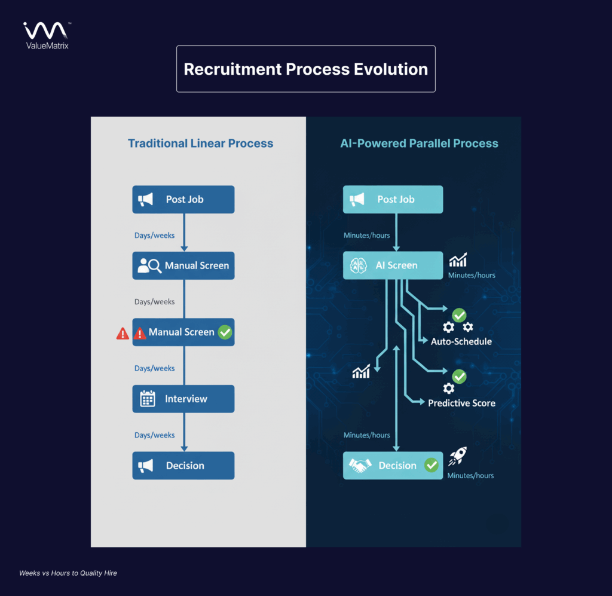
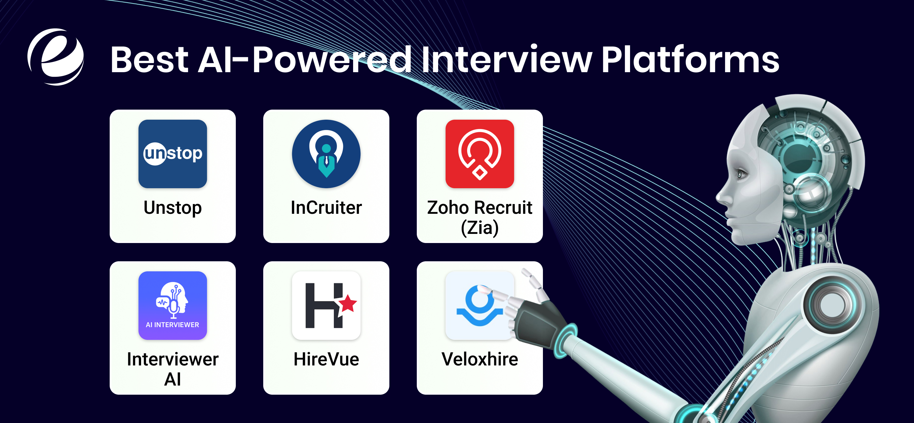
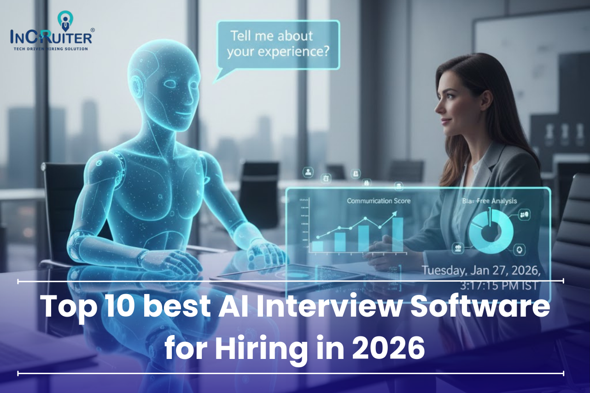

# Mastering Job Interviews in 2026: Trends, Tools, and Techniques

## Understand the Evolution of Interviews in 2026

The landscape of job interviews has undergone a profound transformation in recent years, driven largely by digital transformation and automation. By 2026, hiring processes have shifted from traditional, largely manual stages toward highly automated workflows that enhance efficiency and candidate experience. Automation now permeates everything from initial candidate screening to post-interview analytics, fundamentally reshaping how companies identify and select talent ([Source](https://www.imocha.io/blog/interview-best-practices-for-hiring-managers)).

One of the most significant changes is the pervasive integration of Artificial Intelligence (AI) in interview workflows. AI tools not only automate scheduling to reduce human error and delays but also perform intelligent resume screening, often replacing the initial CV review stage. These systems analyze candidate data against job requirements more quickly and objectively than traditional methods. Furthermore, AI-driven interview platforms utilize natural language processing and facial recognition to assess soft skills and emotional tone during video interviews, offering hiring teams deeper insights early in the process ([Source](https://klearskill.com/blog/ai-interview-tools-2026)).

Reflecting the limitations of CVs in predicting job performance, there has been a notable shift toward structured and behavioral assessments. Organizations prioritize evidence-based interviews, focusing on competencies and past behaviors using frameworks like the STAR method (Situation, Task, Action, Result). These assessments provide a richer understanding of candidates' problem-solving abilities and cultural fit. Behavioral and skill-based interviews have become standard, helping to reduce unconscious bias and ensuring fairer candidate evaluations ([Source](https://nspire.ai/blog/behavioral-interview-questions-2026-the-star-method-mastery-guide)).

The combined impact of these changes affects both candidates and hiring teams profoundly. For candidates, the process is often more transparent, with AI-driven feedback and resources to help tailor their preparation. However, candidates must now navigate complex multi-stage digital evaluations that may include asynchronous video interviews, AI-powered coding challenges, and scenario-based assessments. For hiring managers and recruiters, the evolution means relying on technology to sift through high volumes of applicants efficiently, focus scarce human interaction on final decision-making, and leverage data analytics to improve hiring outcomes ([Source](https://www.imocha.io/blog/interview-intelligence-platforms)).

Common interview protocols in 2026 increasingly involve multi-stage video interviewing combined with AI-powered assessments. For example, candidates may first complete an AI-analyzed video response designed to evaluate communication and situational judgement. Successful candidates then advance to live interviews supported by AI tools that transcribe and analyze responses in real-time, providing interviewers with suggested follow-up questions based on candidate answers. This orchestrated approach balances automation with personalized human evaluation to streamline selection while maintaining candidate engagement ([Source](https://www.gomokka.com/resources/10-best-ai-interview-tools-for-hiring-teams-in-2026.html)).

*Evolution of Interview Process in 2026: From Traditional to AI-driven Automated Workflow*

In summary, the evolution of interviews in 2026 reflects a shift towards precision and automation, with AI-supported, behavioral and skill-based methods becoming the new standard. Both candidates and hiring teams must adapt to these changes by embracing digital tools and honing new interview competencies to succeed in this transformed recruiting environment.

## Identify the Top 2026 Interview Best Practices for Hiring Managers

As the job market evolves in 2026, hiring managers must update their interview strategies to attract top talent while ensuring fairness and effectiveness. Several best practices have emerged this year that focus on evaluating candidates beyond outdated clichés, improving consistency in evaluation, and enhancing the overall candidate experience.

### Move Beyond Outdated Questions to Focus on Problem-Solving and Cultural Fit

Traditional interview questions that revolve around generic or hypothetical situations are losing relevance. Instead, the emphasis in 2026 is on assessing candidates' **problem-solving abilities**, **adaptability**, and how well they fit the company culture. Behavioral and situational questions grounded in real work scenarios help unearth how candidates respond under pressure and adapt to changing environments. For example, asking candidates to describe a time they had to learn a new skill quickly or navigate ambiguity gives deeper insights than simply listing qualifications [Source](https://www.imocha.io/blog/interview-best-practices-for-hiring-managers).

### Implement Structured Scoring Systems for Fairness and Better Hiring Decisions

Subjectivity can bias interviews, which deters diversity and misses the best hires. To combat this, structured interview processes anchored by standardized scoring rubrics are critical. Hiring managers should define core competencies relevant to the role and assign clear evaluation criteria with numeric or categorical ratings. This method ensures that all candidates are assessed consistently and decisions are justifiable. Multiple interviewers can use these scorecards to aggregate unbiased feedback, improving collective decision-making [Source](https://www.imocha.io/blog/interview-best-practices-for-hiring-managers).

### Create a Positive Candidate Experience to Enhance Employer Branding

The interview experience shapes how candidates perceive your organization. In 2026, a positive candidate journey--marked by transparent communication, respect for time, and engaging interactions--is essential not only to attract talent but also to build a strong employer brand. Prompt feedback, clear expectations, and accommodations for remote or hybrid candidates differentiate leading companies. Remember, candidates today often share their experiences online, and a poor interview process can harm your reputation [Source](https://www.oleeo.com/blog/recruitment-trends-2026-5-shifts-you-shouldnt-ignore).

### Incorporate Practical Simulations and Role-Specific Scenarios

Skill-based assessments through **realistic simulations** have become a cornerstone of modern interviewing. Candidates are given tasks or problems closely mirroring the actual job, enabling evaluators to observe how they apply their knowledge in practice. For example, coding challenges for software engineers, mock sales calls for sales roles, or design tasks for creative positions reveal capability far better than theoretical questions. These simulations can often be standardized and delivered digitally, streamlining evaluation while maintaining rigor [Source](https://www.imocha.io/blog/interview-best-practices-for-hiring-managers).

### Leverage AI Tools as Augmentations, Not Replacements for Human Judgment

Artificial intelligence tools are now widely adopted in screening, scheduling, and preliminary assessments. In 2026, best practices advocate using AI **as an augmentation rather than a replacement**. AI-driven analytics can analyze speech patterns, coding submissions, or behavioral cues to provide additional data points, but human interviewers must remain at the center to interpret nuances, contextualize responses, and make empathetic decisions. Leveraging AI thoughtfully reduces administrative burden and bias while preserving the humanity of hiring [Source](https://klearskill.com/blog/ai-interview-tools-2026).

---

By adopting these updated practices, hiring managers will conduct fairer, more engaging interviews that effectively identify the right candidates while strengthening their organization's reputation as a desirable workplace. Embracing both human judgment and advanced technology sets the stage for successful hiring in 2026 and beyond.

## Prepare for the Most Common Job Interview Questions of 2026

In 2026, job interviews have evolved beyond traditional Q&A, emphasizing behavioral insights, skill demonstration, and adaptability to technology--especially AI. For candidates, mastering responses to behavioral and technical questions requires structured preparation and a focus on relevance. Here's how to craft confident and impactful answers to the most common interview questions today.

### Leverage the STAR Framework for Behavioral Questions

Behavioral questions remain central, as employers seek to predict future performance based on past experiences. The STAR method--Situation, Task, Action, Result--is indispensable for structuring clear and compelling answers. Start by describing the context (Situation) and what you were responsible for (Task). Then explain the steps you took (Action) and conclude with the tangible outcome (Result). This approach demonstrates your problem-solving and communication skills while making your achievements concrete and memorable ([Source](https://nspire.ai/blog/behavioral-interview-questions-2026-the-star-method-mastery-guide)).

### Align Your Strengths and Experiences with the Role

Generic answers no longer suffice. Effective candidates tailor their responses to the job requirements, highlighting strengths most relevant to the position. Before the interview, analyze the job description and company values to identify which experiences resonate. For example, if a role emphasizes innovation, mention instances where you applied creative solutions or introduced new processes. This alignment shows that you understand the role's demands and have the capabilities to meet them ([Source](https://www.corporatenavigators.com/articles/hr-trends/10-job-interview-2026)).

### Quantify Impact and Demonstrate Self-Awareness

Hiring managers increasingly seek evidence of measurable impact. Whenever possible, include data points in your answers--like improving efficiency by a percentage, reducing costs, or increasing customer satisfaction scores. Additionally, self-awareness is key. Reflect on both successes and lessons learned. Admitting challenges and explaining how you grew from them signals emotional intelligence and a growth mindset, qualities highly prized in 2026's dynamic workplaces ([Source](https://www.imocha.io/blog/interview-best-practices-for-hiring-managers)).

### Address Questions on Adaptability, Leadership, AI Use, and Problem-Solving

Interviewers now commonly ask about adaptability, leadership style, experience working with AI systems, and complex problem-solving. Prepare examples that show flexibility in fast-changing environments, how you motivate and guide teams, and your ability to leverage AI tools to augment your work. For instance, describe a scenario where you integrated AI-driven insights to improve decision-making or workflow efficiency. This illustrates your readiness to thrive in technology-enhanced workplaces ([Source](https://klearskill.com/blog/ai-interview-tools-2026)).

### Practice Ethical and Decision-Making Scenario Responses

Ethical dilemmas and situational judgment questions are increasingly prevalent as companies prioritize integrity and responsible AI use. Prepare thoughtful responses that reflect your values and critical thinking skills. For example, if asked how you would handle data privacy concerns in AI applications, discuss balancing innovation with ethical compliance. Practicing these scenarios demonstrates your ability to navigate complex workplace dilemmas and make principled decisions ([Source](https://integritystaffing.com/blog/interview-questions-2026)).

---

By combining STAR-based narratives with job-specific alignment, measurable results, and awareness of the evolving workplace demands--including AI integration and ethical considerations--candidates will be well-prepared to meet the expectations of 2026 interviews confidently and effectively.

## Explore Cutting-Edge AI Interview Tools and Platforms in 2026

In 2026, the interview landscape is profoundly transformed by AI-powered tools designed to enhance the efficiency, fairness, and effectiveness of hiring processes. Both interviewers and candidates are leveraging these innovations to improve interview quality, better assess skills and behaviors, and streamline preparation. This section explores the key types of AI tools currently shaping recruitment, the platforms offering advanced features, candidate-focused resources, and the benefits and challenges they present.

### Types of AI Tools Revolutionizing Interviews

**Scheduling Assistants**  
AI scheduling assistants automate the coordination of interview times across multiple stakeholders. They handle availability conflicts, suggest optimal time slots considering time zones, and send reminders, saving hours of manual back-and-forth [Source](https://www.imocha.io/blog/interview-best-practices-for-hiring-managers).

**Asynchronous Video Interviews with AI Scoring**  
Async video platforms record candidate responses to preset questions, which AI then analyzes for insights such as speech patterns, confidence, and content relevance. This allows interviewers to evaluate multiple applicants on demand and apply consistent scoring criteria, facilitating unbiased, scalable assessments [Source](https://klearskill.com/blog/ai-interview-tools-2026).

**Live Interview Copilots**  
During live interviews, AI copilots generate real-time suggestions--prompting follow-up questions, flagging inconsistencies, or highlighting candidate strengths. These tools help interviewers dive deeper into behavioral or technical queries and ensure no critical assessment criteria are missed [Source](https://www.imocha.io/blog/interview-best-practices-for-hiring-managers).

### Platforms Offering Advanced Interview Features

Several platforms integrate live coding environments, virtual whiteboards, and AI-driven scoring mechanisms tailored to technical roles and collaborative problem-solving.

- **Live coding and virtual whiteboarding:** Platforms like Mokka AI and HackerEarth provide interactive coding sessions with real-time AI-generated feedback on code quality, problem-solving approaches, and time efficiency. These tools simulate the collaborative nature of real-world software development [Source](https://www.gomokka.com/resources/10-best-ai-interview-tools-for-hiring-teams-in-2026.html).

- **AI-driven scoring:** Comprehensive recruitment platforms now incorporate AI to score both technical and behavioral interviews using data-driven models. Scores derived from behavioral pattern recognition, skill demonstration, and communication effectiveness help reduce human bias and articulate a candidate's fit with role requirements [Source](https://www.imocha.io/blog/interview-intelligence-platforms).

### Candidate-Facing AI Tools for Preparation and Assistance

Candidates benefit from AI tools that personalize interview preparation by simulating realistic scenarios, providing feedback on answers, and coaching users on body language and speech clarity. These platforms may offer:

- Mock interviews using virtual assistants mimicking popular question types and behavioral prompts in 2026 [Source](https://www.revarta.com/blog/interview-prep-buyers-guide-2026).

- Real-time interview coaching--including hints and alerting when answers deviate from desired frameworks such as the STAR method--boosting confidence and readiness [Source](https://nspire.ai/blog/behavioral-interview-questions-2026-the-star-method-mastery-guide).

### Benefits and Potential Risks

**Benefits:**  
- **Efficiency:** Automated scheduling and AI scoring drastically reduce time-to-hire.  
- **Consistency:** AI applies standardized criteria, minimizing subjective bias.  
- **Insight:** Advanced analytics uncover deeper candidate abilities beyond resumes.

**Risks:**  
- **Bias:** AI models trained on historical data may perpetuate biases unless carefully audited.  
- **Fraud:** AI must detect synthetic responses and ensure authenticity to prevent misleading evaluations.  
- **Privacy:** Managing sensitive candidate data requires adherence to robust security and ethical standards [Source](https://klearskill.com/blog/ai-interview-tools-2026).

### Industry-Leading AI Tools and Platforms in 2026

Top AI interview tools making waves in 2026 include:

- **Mokka AI:** Combines AI-assisted video interviews, automated scoring, and scheduling within a unified platform [Source](https://www.gomokka.com/resources/10-best-ai-interview-tools-for-hiring-teams-in-2026.html).

- **iMocha:** Offers skill assessments alongside AI-powered interview intelligence, including live interviewer aids and analytics dashboards [Source](https://www.imocha.io/blog/interview-intelligence-platforms).

- **HackerEarth:** Recognized for live coding exercises enriched with AI-driven feedback on problem-solving processes, particularly for tech roles [Source](https://www.hackerearth.com/blog/ai-interviewer-in-2026-what-they-are-how-they-work-and-why-they-matter-for-recruiters).

- **Revarta:** Focuses on candidate prep by delivering AI interview coaching, mock interviews, and real-time assistance to boost readiness [Source](https://www.revarta.com/blog/interview-prep-buyers-guide-2026).

*Key AI-Powered Interview Tools and Platforms in 2026*

By mastering these AI-powered technologies, hiring managers can significantly improve the interview process's accuracy and efficiency, while candidates gain tailored support to showcase their best selves. However, vigilance around AI ethics remains paramount to ensure fair and trustworthy hiring outcomes in 2026 and beyond.

## Execute Successful Remote and Virtual Interviews with AI Support

As remote and virtual interviews become the norm in 2026, hiring managers and recruiters must embrace best practices that maximize candidate experience and hiring effectiveness. Video calls and asynchronous interview formats each offer unique advantages, but both require thoughtful design to succeed. For live video interviews, ensure a stable, user-friendly platform that supports features like screen sharing and real-time collaboration. Prepare clear guidelines for interviewers and candidates on dress code, background setup, and etiquette to maintain professionalism. Asynchronous video responses allow candidates flexibility and reduce scheduling complexities, but require well-structured prompts and timely feedback to keep candidates engaged. Incorporating collaborative simulations during live interviews--such as coding exercises or role plays via shared digital workspaces--helps assess practical skills in a realistic context. Additionally, asynchronous communication tests evaluating written and spoken communication provide deeper insight into candidates' aptitude beyond traditional Q&A [Source](https://www.imocha.io/blog/interview-best-practices-for-hiring-managers).

Artificial intelligence (AI) plays a pivotal role in scaling and standardizing these processes. AI-powered tools can automatically transcribe and analyze interview responses to highlight relevant behavioral competencies and technical skills, reducing bias and increasing consistency [Source](https://klearskill.com/blog/ai-interview-tools-2026). Automated sentiment analysis and voice modulation detection enhance interviewer insights, particularly during asynchronous interviews. Moreover, AI-driven candidate ranking and matching engines accelerate screening by focusing recruiter attention on top fits, enabling higher precision in talent selection [Source](https://www.gomokka.com/resources/10-best-ai-interview-tools-for-hiring-teams-in-2026.html). These platforms often integrate with applicant tracking systems (ATS) for seamless workflow management.

However, remote interviewing introduces challenges that require proactive management. Candidate engagement can wane without in-person cues; therefore, training interviewers to provide clear agendas, active listening, and timely encouragement is critical [Source](https://www.imocha.io/blog/interview-best-practices-for-hiring-managers). Technical issues remain prevalent--conducting technology checks before the interview and having dedicated IT support ready minimizes disruptions. Fraud prevention is another concern: AI-enabled facial recognition and voice biometrics help verify identity, but should be balanced with privacy considerations and explicit candidate consent [Source](https://www.wecreateproblems.com/blog/how-ai-is-changing-remote-interviews).

To fully leverage virtual formats, incorporate collaboration simulations and asynchronous communication exercises into the interview blueprint. For example, group problem-solving sessions via virtual whiteboards simulate real teamwork scenarios, while asynchronous tasks like video presentations or written assignments provide a sample of independent work style [Source](https://www.artech.com/blog/how-interviewing-is-evolving-in-2026).

Despite the power of AI, human judgment remains indispensable. Interviewers must interpret AI-generated insights within the broader context of interpersonal communication and organizational culture fit. A balanced approach marries AI's data-driven objectivity with the empathic intuition of skilled recruiters. Establish clear protocols whereby AI flags candidates or responses for further human review, and continuously monitor AI performance to mitigate unintended biases [Source](https://www.hackerearth.com/blog/ai-interviewer-in-2026-what-they-are-how-they-work-and-why-they-matter-for-recruiters).

In summary, mastering remote and virtual interviews with AI support entails:
- Employing best practices for both synchronous and asynchronous formats to improve candidate experience.
- Leveraging AI tools for consistent evaluation, scalable screening, and fraud prevention.
- Addressing engagement and technical challenges proactively.
- Designing collaborative simulations and communication tests to assess real-world skills.
- Maintaining a hybrid model where AI augments but does not replace human decision-making.

This approach empowers recruiters and hiring managers to execute efficient, fair, and insightful remote interviews geared toward identifying top talent in the evolving 2026 landscape.

## Create a Candidate-Centric Interview Experience in 2026

In 2026, building a candidate-centric interview experience is more crucial than ever for attracting and retaining top talent. As hiring landscapes evolve, candidates prioritize transparency, flexibility, and rapid communication throughout the recruitment process. Recruiters should acknowledge these priorities to foster trust and engagement from the outset.

### Prioritize Transparency, Flexibility, and Communication Speed

Candidates today expect clear insights into the interview timeline, criteria, and next steps. Providing detailed information upfront reduces uncertainty and empowers candidates to prepare effectively. Flexibility, such as offering multiple scheduling options or virtual interview formats, caters to diverse candidate circumstances, enhancing their overall experience. Swift and consistent communication is essential to maintain candidate interest and respect their time, thereby improving company reputation in a competitive hiring market [Source](https://www.imocha.io/blog/interview-best-practices-for-hiring-managers).

### Reduce Anxiety Through Clear Communication

Uncertainty breeds anxiety, which can hinder candidate performance. To mitigate this, recruiters should meticulously outline each stage of the interview process, set expectations for interview formats, and clarify evaluation criteria. For example, sharing whether interviews will focus on behavioral assessments, skills tests, or technical challenges helps candidates prepare mentally and materially. This transparency is not just empathy--it directly improves interview quality and candidate retention rates [Source](https://www.artech.com/blog/how-interviewing-is-evolving-in-2026).

### Leverage Feedback Mechanisms

In 2026, feedback loops have become an integral part of refining the candidate experience. Utilizing post-interview surveys or interactive platforms where candidates can share real-time impressions informs continuous process improvements. Feedback doesn't just help recruiters adjust workflows; it signals candidates that their voices matter, fostering goodwill and positive brand perception [Source](https://www.imocha.io/blog/interview-best-practices-for-hiring-managers).

### Focus on Practical and Skills-Based Evaluations

Modern hiring emphases have shifted from polished verbal responses toward exercises demonstrating actual skills and problem-solving capabilities. Behavioral interviews combined with practical assessments such as coding tests, case studies, or task simulations provide a more reliable gauge of job readiness. This approach reduces bias associated with conversational polish, promoting fairness and better candidate-job fit [Source](https://www.coursereport.com/blog/technical-interviews-in-2026-how-to-stand-out-in-the-age-of-ai).

### Candidate Experience Directly Impacts Offer Acceptance

Data shows that candidates who have a positive interview experience are significantly more likely to accept job offers. Conversely, poor communication, unclear expectations, or prolonged silence contribute to offer rejections--even for highly qualified candidates. Companies that invest in candidate-centric processes see lower dropout rates and enhanced employer brand equity, which are critical differentiators in today's talent market [Source](https://www.oleeo.com/blog/recruitment-trends-2026-5-shifts-you-shouldnt-ignore).

By embedding transparency, leveraging feedback, emphasizing practical skills, and prioritizing clear communication, recruiters can create an interview experience that not only attracts top candidates but also converts them into successful hires. This holistic approach is essential to stay competitive in the rapidly evolving hiring landscape of 2026.

## Leverage Interview Data and Intelligence for Better Hiring Decisions

In 2026, data-driven recruitment has become a cornerstone of effective hiring processes. Leveraging structured scoring, AI-based analytics, and comprehensive feedback mechanisms empowers hiring teams to make informed, fair, and consistent hiring decisions. This section explores how interview data and intelligence tools can enhance selection outcomes in today's competitive talent landscape.

### Implement Structured Scoring to Reduce Bias and Improve Fairness

Structured scoring frameworks are essential to eliminate subjective biases that commonly affect interview evaluations. By defining clear rating criteria aligned with job competencies and behavioral indicators, interviewers can assign consistent scores across candidates. This not only standardizes assessment but also enhances fairness by focusing on observable evidence rather than gut feelings or unconscious bias. According to industry best practices, adopting structured interview rubrics supports diversity and inclusion goals by ensuring candidates are measured against objective benchmarks ([iMocha](https://www.imocha.io/blog/interview-best-practices-for-hiring-managers)).

### Use AI-based Interview Intelligence Platforms for Post-Interview Analysis

AI-driven platforms play a transformative role in analyzing interview data post-session. These tools can transcribe, code, and evaluate candidate responses to behavioral and technical questions, extracting key metrics such as communication effectiveness, technical competency, and emotional intelligence. For example, modern interview intelligence platforms integrate natural language processing and machine learning algorithms to provide hiring teams with actionable insights and candidate fit scores. This reduces manual analysis efforts and brings consistency to evaluations, especially when dealing with large applicant pools. Leading platforms in 2026 offer seamless integration with applicant tracking systems to streamline workflows ([iMocha](https://www.imocha.io/blog/interview-intelligence-platforms), [Klearskill](https://klearskill.com/blog/ai-interview-tools-2026)).

### Analyze Patterns to Spot High Achievers and Learning Agility

Beyond individual interviews, hiring teams should harness data analytics to detect patterns indicating high performers and adaptive learners. Interview intelligence platforms enable trend analysis, highlighting attributes such as problem-solving abilities, resilience, and continuous learning orientation across multiple candidates. Identifying these traits helps recruiters prioritize candidates with a higher probability of success and growth within the organization. This predictive approach lowers turnover risks and aligns talent acquisition with long-term strategic goals ([SHRM](https://www.shrm.org/topics-tools/news/talent-acquisition/talent-acquisition-management-trends-2026)).

### Incorporate Multi-Rater Feedback and Calibration Meetings

To further enhance decision-making fairness and accuracy, incorporating multi-rater feedback is essential. Multiple interviewers evaluate the same candidate independently, providing diverse perspectives on skills and fit. Calibration meetings follow to reconcile scoring discrepancies, discuss qualitative impressions, and ensure alignment on candidate evaluations. Such cross-functional calibration promotes transparency and reduces individual biases. Teams that adopt this collaborative approach report more reliable hiring outcomes and positive candidate experiences ([iMocha](https://www.imocha.io/blog/interview-best-practices-for-hiring-managers)).

### Continuously Refine Interview Questions Based on Data Insights

An iterative process of question refinement anchored in data insights elevates interview effectiveness. Hiring teams should routinely analyze question-level performance metrics such as discriminatory power, candidate engagement, and predictive validity. Questions that do not contribute meaningful differentiation or consistently confuse candidates should be revised or replaced. Data-driven optimization ensures that interview content evolves alongside changing job requirements and market conditions, maintaining relevance and maximizing the quality of candidate assessment. Integrating feedback from AI analytics and interviewers fosters a culture of continuous improvement ([nSpire AI](https://nspire.ai/blog/behavioral-interview-questions-2026-the-star-method-mastery-guide)).

---

Harnessing interview data and intelligence is not merely a technology upgrade but a strategic mandate for organizations seeking to hire with precision in 2026. By combining structured scoring, AI-powered analytics, multi-rater perspectives, and continuous question refinement, hiring teams can dramatically enhance the rigor and fairness of their recruitment processes--translating directly into better hires and stronger workforce outcomes.

*Leveraging Interview Data and AI Analytics for Better Hiring Decisions in 2026*