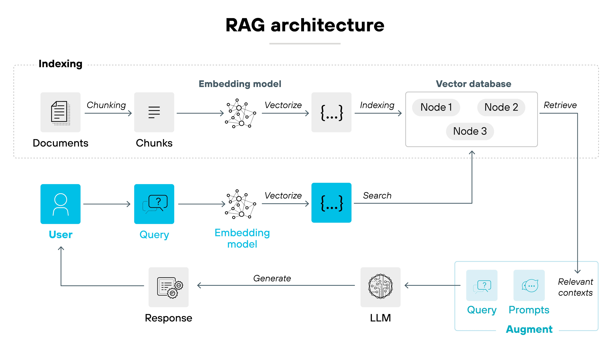
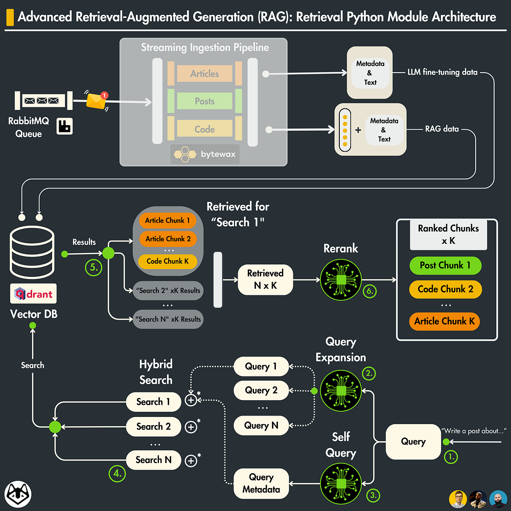

# Mastering Retrieval-Augmented Generation (RAG) in 2026: A Practical Hybrid Guide

## Understand the fundamentals of Retrieval-Augmented Generation (RAG)

Retrieval-Augmented Generation (RAG) is an advanced AI technique that synergistically combines the strengths of retrieval-based and generative models, enabling systems to produce factual, contextually relevant outputs grounded in a large corpus of external knowledge. Instead of relying solely on the parametric memory stored within the weights of large language models (LLMs), RAG systems dynamically retrieve pertinent information from an external dataset during inference. This hybrid approach effectively expands the knowledge base of the model and mitigates hallucinations often encountered in pure generation models.

A typical RAG pipeline consists of several well-defined components working in concert:

1. **Document Loading:** The first step involves collecting and ingesting a diverse set of documents relevant to the target domain. These documents can range from PDFs and webpages to databases and knowledge bases.

2. **Chunking:** Given that many retrieval systems impose input size constraints, large documents are segmented into smaller, semantically coherent chunks. Proper chunking preserves the contextual integrity of each passage, optimizing retrieval effectiveness.

3. **Indexing:** These chunks are then converted into vector representations using embedding models and stored in an efficient vector index (e.g., FAISS, Weaviate). Indexing enables rapid similarity search during the retrieval phase.

4. **Retrieval:** At query time, the system embeds the input question or prompt into the same vector space and performs a nearest-neighbor search against the index to retrieve the most relevant chunks.

5. **Generation:** The retrieved chunks are fed as context to a generative model--such as a transformer-based LLM--which produces the final output. This generative step leverages both the parametric knowledge of the language model and the non-parametric, up-to-date external information retrieved.

By augmenting generation with retrieval, RAG systems notably improve knowledge grounding in generated text. They significantly reduce hallucinations--instances where LLMs fabricate or guess unsupported facts--by providing real-time access to factual documents. This makes RAG especially valuable for enterprise applications requiring accurate, verifiable outputs, such as legal document analysis or medical diagnosis support.

An important conceptual distinction within RAG architectures is between **parametric** and **non-parametric** knowledge:

- **Parametric knowledge** is stored implicitly in the model's weights after training. While powerful, it is static and can become outdated; fine-tuning or retraining is required to incorporate new facts.

- **Non-parametric knowledge** is stored externally in a retrieval system and accessed dynamically. This enables the model to tap into fresh, domain-specific information without expensive retraining, enhancing flexibility and scalability.

Understanding these core concepts and pipeline stages sets a solid foundation for implementing and optimizing RAG systems that bridge knowledge retrieval and natural language generation effectively in 2026 and beyond.


*Core components and workflow of a Retrieval-Augmented Generation (RAG) system, showing Document Loading, Chunking, Indexing, Retrieval, and Generation stages.*

## Explore the Latest Types and Advancements in RAG Techniques in 2026

As Retrieval-Augmented Generation (RAG) matures in 2026, the landscape of RAG architectures continues to diversify rapidly. To equip developers, ML engineers, and AI researchers with actionable insights, it is essential to survey the cutting-edge variations and understand how these innovations enable more powerful and versatile applications. Below, we explore 14 to 20 advanced RAG types gaining traction, unpack their unique capabilities, and highlight emerging patterns that address key enterprise and research challenges.

### Diverse and Advanced RAG Variants to Know

Modern RAG systems have evolved from classical document retrieval plus generative modeling into sophisticated hybrids integrating varied modalities and adaptive processes. Some representative advanced RAG types include:

- **GraphRAG:** Incorporates *knowledge graphs* to provide structured relational context, enabling more explainable and logically consistent generation by grounding retrieved facts within graph-based reasoning frameworks.
- **Multimodal RAG:** Extends beyond text to fuse *vision inputs* (images, videos) with text retrieval, driving richer context comprehension in domains like medical imaging, e-commerce, and autonomous systems.
- **Adaptive Retrieval RAG:** Dynamically selects retrieval sources or retrieval parameters based on current query complexity, user profile, or available computation, optimizing accuracy-latency tradeoffs at runtime.
- **Query Rewriting RAG:** Implements iterative query reformulation to clarify ambiguous or complex user intents, thereby improving retrieval relevance before generation.

Other notable variants include Cross-lingual RAG for *multilingual QA*, Federated RAG architectures for privacy-preserving data integration, and Self-supervised RAG models that bootstrap training from unlabeled corpora.

These emerging types have been cataloged and analyzed comprehensively in recent surveys ([Source](https://www.turingpost.com/p/ragtypes), [Source](https://www.meilisearch.com/blog/rag-types)).

### Integrating Knowledge Graphs, Multimodal Inputs, and Multilingual Capabilities

A major trend in 2026 is the seamless integration of *knowledge graphs* into RAG workflows to inject structured domain expertise. This integration allows models to reason over entity relations fetched from graph databases--improving factual consistency and enabling complex question answering beyond surface text matching [Source](https://verysell.ai/retrieval-augmented-generation-best-knowledge-for-2026).

Vision-enabled RAG is another breakthrough, leveraging advanced encoders to process images or videos alongside text documents. Techniques such as joint embedding spaces and cross-attention layers allow fused retrieval and generation pipelines to explain complex visual scenes or instructions ([Source](https://towardsai.net/p/machine-learning/building-state-of-the-art-vision-enabled-rag-pipelines-2026)).

Moreover, *multilingual RAG systems* are becoming standard for global applications by supporting queries and retrieval in multiple languages, with cross-lingual representations ensuring coherent answer generation. This is vital for enterprises serving diverse demographics and international research collaborations [Source](https://atlan.com/know/what-is-rag).

### Self-reflective and Reranking Patterns that Boost Accuracy

Cutting-edge RAG architectures increasingly incorporate *self-reflective* mechanisms -- where the generation output is internally evaluated to identify hallucinations or gaps, triggering iterative refinement or additional retrieval steps. This feedback loop enhances answer quality substantially.

Complementary to this are *reranking* patterns, where multiple candidates from the retrieval step are scored by specialized rerankers (often fine-tuned transformer-based modules) focused on semantic relevance and factual alignment. These techniques help prune noisy documents and surface the most useful information for generation.

Together, self-reflection and reranking form a robust pipeline pattern to maximize precision without sacrificing retrieval recall ([Source](https://dev.to/suraj_khaitan_f893c243958/-rag-in-2026-a-practical-blueprint-for-retrieval-augmented-generation-16pp)).

### Addressing Latency and Scale in State-of-the-Art RAG Systems

Handling latency and scale remains a central challenge as RAG moves beyond research prototypes toward enterprise-grade deployments. Recent approaches to mitigate these challenges include:

- **Hierarchical Retrieval:** Multi-stage retrieval pipelines first filter at coarse granularity (e.g., clusters or partitions) before fine-grained search, balancing response times and retrieval scope.
- **Approximate Nearest Neighbors (ANN) and Index Compression:** Use of optimized vector indexes, quantization, and pruning algorithms reduce retrieval costs on large corpora to milliseconds-scale.
- **Edge and Federated Retrieval:** Distributing retrieval closer to data sources or user endpoints to reduce network overhead and enhance privacy.
- **Cached Contextual Embeddings & Distillation:** Precomputing document embeddings and using distilled models in generation to lower inference time without degrading quality.

These engineering innovations, combined with continuous hardware acceleration advances, ensure RAG systems meet the demanding throughput and latency requirements of 2026 enterprise environments ([Source](https://www.kapa.ai/blog/how-to-build-a-rag-pipeline-from-scratch-in-2026)).


*Summary diagram of advanced retrieval-augmented generation types including GraphRAG, Multimodal RAG, Adaptive Retrieval, Query Rewriting, self-reflective and reranking patterns, and scalability optimizations.*

---

Understanding these cutting-edge RAG types and techniques empowers practitioners to architect tailored solutions that maximize retrieval quality, leverage diverse data modalities, and scale effectively. In the following sections, we will explore toolkits and frameworks that bring these concepts into practical implementation for researchers and enterprises alike.

---

*References:*  
- 20 Advanced RAG Types to Know in 2026 | [TuringPost](https://www.turingpost.com/p/ragtypes)  
- 14 types of RAG (Retrieval-Augmented Generation) | [Meilisearch](https://www.meilisearch.com/blog/rag-types)  
- RAG in 2026: A Practical Blueprint | [DEV Community](https://dev.to/suraj_khaitan_f893c243958/-rag-in-2026-a-practical-blueprint-for-retrieval-augmented-generation-16pp)  
- Building Vision-Enabled RAG Pipelines | [Towards AI](https://towardsai.net/p/machine-learning/building-state-of-the-art-vision-enabled-rag-pipelines-2026)  
- How to Build a RAG Pipeline from Scratch in 2026 | [kapa.ai](https://www.kapa.ai/blog/how-to-build-a-rag-pipeline-from-scratch-in-2026)  
- Retrieval Augmented Generation Best Knowledge in 2026 | [Verysell.ai](https://verysell.ai/retrieval-augmented-generation-best-knowledge-for-2026)

## Select the best frameworks and tools for building RAG pipelines in 2026

When building Retrieval-Augmented Generation (RAG) systems in 2026, selecting the right framework is crucial to streamline development, ensure scalability, and fit your project's complexity and deployment needs. Here's an overview of the leading open-source and enterprise-ready RAG frameworks, evaluated on integration ease, maintenance, extensibility, and support for enterprise features.

### Leading RAG Frameworks and Their Highlights

- **LangChain**: Highly popular in the developer community, LangChain offers a modular, Pythonic interface to compose retrieval and generation components flexibly. It supports extensive integrations with vector stores, LLMs, and custom retrievers, making it excellent for rapid prototyping and production apps alike. Its growing ecosystem and documentation simplify maintenance and extensibility, especially for startups and research projects.  
- **Haystack**: Designed with enterprise needs in mind, Haystack stands out for its robust orchestration capabilities, native support for knowledge updates, versioning, and secured deployments. It features built-in connectors for document stores like Elasticsearch and OpenSearch, emphasizing scalability and operational stability in large-scale environments.  
- **LlamaIndex (formerly GPT Index)**: Known for its powerful indexing abstractions, LlamaIndex excels in handling diverse data sources, including complex document structures and large knowledge bases. It fits research pipelines and enterprise environments requiring fine-grained control over data ingestion and retrieval strategies.  
- **FARM**: Developed by deepset, FARM is optimized for transfer learning and provides tools to build adaptable RAG pipelines leveraging fine-tuned retrieval and generation models. It supports seamless integration with Haystack, useful for projects needing custom model training and adaptation to domain-specific knowledge.  
- **REALM (Retrieval-Augmented Language Model)**: This framework focuses on pretraining models with retrieval components tightly integrated, facilitating state-of-the-art accuracy in knowledge-sensitive tasks. While research-oriented, evolving versions now support easier integration and scaling for production.  
- **RAGFlow**: A newer entrant focused on workflow automation, RAGFlow emphasizes orchestration, monitoring, and secure knowledge lifecycle management, targeting enterprises that prioritize regulated industries and compliant deployments.  

### Evaluation Criteria

- **Ease of Integration**: LangChain and Haystack lead here with extensive connectors, APIs, and community examples, reducing time-to-live for developers.  
- **Maintenance and Extensibility**: LlamaIndex offers flexible data handling, while FARM shines in adapting models through transfer learning, helpful in evolving knowledge domains.  
- **Scalability**: Haystack and RAGFlow provide orchestration tools to handle large datasets and concurrent queries reliably, suitable for enterprise workloads.  
- **Enterprise Features**: Security, knowledge update mechanisms, versioning, and audit trails are best implemented in Haystack and RAGFlow, essential for regulated sectors like finance and healthcare.

### Recommendations Tailored to Project Needs

- For **rapid prototyping and research**: Start with **LangChain** or **LlamaIndex** for developer-friendly abstractions and flexible data ingestion.  
- For **custom model training and domain adaptation**: Consider **FARM** integrated with Haystack for combining fine-tuned models with enterprise-grade infrastructure.  
- For **enterprise-grade deployment at scale**: Opt for **Haystack** or **RAGFlow** to leverage built-in data security, orchestration, and knowledge management features.  
- For **cutting-edge research applications** exploring pretraining innovations: **REALM** remains a valuable choice, balancing retrieval-augmented learning and generative performance.

Selecting the right framework ultimately depends on your project's scale, regulatory requirements, team expertise, and the complexity of your retrieval and generation needs. Combining some of these tools is a common strategy to maximize benefits across prototyping, training, and deployment pipelines.  

For more detailed comparisons and updated features, check out [The Best RAG Frameworks for Building Enterprise GenAI in 2026](https://www.tredence.com/blog/top-rag-frameworks) and [6 Best RAG Tools for Your Enterprise in 2026](https://www.cake.ai/blog/best-open-source-rag-tools) for a comprehensive perspective.  

---

*References:*  
- [The Best RAG Frameworks for Building Enterprise GenAI in 2026 | Tredence](https://www.tredence.com/blog/top-rag-frameworks)  
- [6 Best RAG Tools for Your Enterprise in 2026 | Cake.ai](https://www.cake.ai/blog/best-open-source-rag-tools)  
- [Top RAG Tools to Boost Your LLM Workflows | lakeFS](https://lakefs.io/blog/rag-tools)  
- [Learn How to Build Reliable RAG Applications in 2026! - DEV Community](https://dev.to/pavanbelagatti/learn-how-to-build-reliable-rag-applications-in-2026-1b7p)

## Build a robust RAG pipeline from scratch using Python and open-source libraries

Implementing a functional Retrieval-Augmented Generation (RAG) pipeline from scratch requires assembling several critical components--document ingestion, efficient vector indexing, retrieval and reranking, and prompt construction for grounded generation. In this section, we'll walk through a practical, Python-based approach leveraging popular open-source tools, reflecting best practices and 2026 trends in RAG system development.

### 1. Setup Environment and Dependencies

First, prepare your Python environment with essential libraries for embeddings, vector stores, and language generation. Common and well-supported packages as of 2026 include:

- **`transformers`** by Hugging Face for pretrained embedding and generation models.
- **`faiss-cpu`** or **`faiss-gpu`** for high-performance vector similarity search.
- **`langchain`** to facilitate RAG pipeline orchestration.
- **`sentence-transformers`** for state-of-the-art embedding models.
- **`datasets`** for loading and processing datasets seamlessly.

Use a virtual environment and install dependencies:

```bash
python -m venv rag-env
source rag-env/bin/activate
pip install transformers faiss-cpu langchain sentence-transformers datasets
```

This setup ensures a modular pipeline where you can swap or upgrade components as the RAG ecosystem evolves [Source](https://dev.to/suraj_khaitan_f893c243958/-rag-in-2026-a-practical-blueprint-for-retrieval-augmented-generation-16pp).

### 2. Document Ingestion and Chunking

Efficient document ingestion involves loading raw text, cleaning, and breaking it into semantically meaningful chunks to improve retrieval relevance. Chunk sizes typically range from 100 to 300 tokens, balancing granularity and context retention.

A practical chunking implementation in Python:

```python
from datasets import load_dataset
from langchain.text_splitter import RecursiveCharacterTextSplitter

# Load documents (example using a local dataset or custom corpus)
dataset = load_dataset("json", data_files={"data": "your_documents.json"}, split="data")

# Initialize chunker
chunker = RecursiveCharacterTextSplitter(chunk_size=200, chunk_overlap=50)

# Chunk documents
docs = []
for doc in dataset:
    chunks = chunker.split_text(doc['text'])
    docs.extend(chunks)
```

This recursive chunking helps break complex documents into retrieval-friendly snippets [Source](https://www.kapa.ai/blog/how-to-build-a-rag-pipeline-from-scratch-in-2026).

### 3. Creating Vector Index

Once chunks are ready, convert them to vector embeddings using a pretrained sentence transformer model. Then build a vector store with FAISS for rapid similarity search.

```python
from sentence_transformers import SentenceTransformer
import faiss
import numpy as np

# Load embedding model
embedding_model = SentenceTransformer('all-MiniLM-L6-v2')

# Embed document chunks
embeddings = embedding_model.encode(docs, convert_to_numpy=True)

# Build FAISS index
dimension = embeddings.shape[1]
index = faiss.IndexFlatL2(dimension)
index.add(embeddings)
```

This in-memory FAISS index supports efficient k-nearest neighbor retrieval by L2 similarity. For larger datasets, persistent storage options with FAISS or alternatives like Weaviate or Milvus can be integrated [Source](https://www.firecrawl.dev/blog/best-open-source-rag-frameworks).

### 4. Develop Retrieval and Reranking Mechanisms

Retrieval returns the top-k closest chunks to a query embedding. To enhance precision, a reranking step using cross-encoders or learned relevance models refines results.

```python
def retrieve(query, top_k=5):
    query_embedding = embedding_model.encode([query], convert_to_numpy=True)
    distances, indices = index.search(query_embedding, top_k)
    retrieved_docs = [docs[i] for i in indices[0]]
    return retrieved_docs
```

For reranking, use a zero-shot cross-encoder reranker or fine-tune a lightweight BERT model on domain relevance labels, boosting precision particularly in enterprise knowledgebases [Source](https://www.turingpost.com/p/ragtypes).

### 5. Construct Prompts for Generation

The final step guides the language model with relevant context. Combine retrieved chunks into a prompt template that frames the query and retrieval content coherently.

```python
from transformers import pipeline

generator = pipeline("text-generation", model="gpt-4-rag-2026")

def generate_answer(query):
    relevant_docs = retrieve(query)
    context = "\n\n".join(relevant_docs)
    prompt = f"Use the following context to answer the question:\n{context}\n\nQuestion: {query}\nAnswer:"
    response = generator(prompt, max_length=200)
    return response[0]['generated_text']
```

Prompt engineering in RAG is crucial to ground the generation in factual retrieved content, reducing hallucinations [Source](https://atlan.com/know/what-is-rag).

### 6. Evaluate the Pipeline

Testing RAG systems involves both retrieval and generative quality metrics. Simple evaluation strategies include:

- **Recall@k**: Measures if relevant documents appear in top-k retrieved items.
- **Exact Match (EM)** or **F1 score**: Compares generated answers against ground-truth reference answers.
- **Human evaluation**: For fluency and factuality.

Example automated recall@k evaluation:

```python
def recall_at_k(query, true_doc, k=5):
    retrieved = retrieve(query, top_k=k)
    return int(true_doc in retrieved) / 1.0

# Simple test
assert recall_at_k("What is RAG?", "RAG stands for Retrieval-Augmented Generation.", k=5) > 0
```

Implementing continuous evaluation during development ensures your RAG system maintains accuracy and robustness in dynamic data environments [Source](https://dev.to/pavanbelagatti/learn-how-to-build-reliable-rag-applications-in-2026-1b7p).


*Block diagram of the RAG pipeline steps implemented in Python: Document Ingestion -> Chunking -> Embedding -> Vector Index -> Retrieval -> Reranking -> Prompt Construction -> Generation, with a code snippet overlay example.*

---

By following these structured steps and leveraging cutting-edge open-source libraries, practitioners can deploy versatile, effective RAG pipelines in Python that align with 2026 standards, supporting both enterprise scalability and research innovation.

## Apply Best Practices and Optimization Techniques for Reliable Production RAG Systems

Building a reliable Retrieval-Augmented Generation (RAG) system for production requires careful attention to multiple factors spanning embedding model choice, vector store design, prompt engineering, monitoring, and enterprise-grade constraints. This section distills essential best practices and optimization strategies that enable robust, scalable, and accurate RAG deployments in 2026.

### Embedding Model Selection and Vector Store Optimization

The foundation of any RAG pipeline lies in the quality and efficiency of its embedding representations and vector retrieval. Leading approaches in 2026 favor embedding models that balance semantic richness with computational efficiency, such as lightweight transformer variants optimized via distillation, quantization, or pruning techniques. Selecting domain-specific embeddings often improves retrieval relevance, especially when dealing with specialized enterprise corpora.

Vector stores have also matured with innovations like approximate nearest neighbor (ANN) search optimizations and hybrid indexing combining semantic and lexical features. Popular frameworks such as FAISS, Pinecone, and Milvus provide enterprise-grade scalability and low-latency search, often integrating GPU acceleration and incremental indexing to ensure real-time responsiveness in live systems ([Source](https://us.pycon.org/2026/schedule/presentation/56), [Source](https://www.cake.ai/blog/best-open-source-rag-tools)).

### Prompt Engineering and Dynamic Query Transformation

Effective prompt engineering remains vital for accuracy and contextual grounding in RAG workflows. Developers use dynamic query transformation techniques that reformulate retrieval inputs based on prior model outputs or user interactions, adapting the prompt contextually to maximize relevance and minimize hallucination.

Leveraging templates with placeholders and conditional prompts enables customization per use case. Additionally, integrating retrieval confidence scores into prompt hints or weighting helps the generative model calibrate its dependency on retrieved passages, enhancing factual consistency ([Source](https://dev.to/suraj_khaitan_f893c243958/-rag-in-2026-a-practical-blueprint-for-retrieval-augmented-generation-16pp)).

### Monitoring, Tuning, and Fallback Mechanisms to Reduce Hallucinations

In live environments, continuous monitoring is essential to detect degradation in retrieval or generation quality. Key performance indicators such as retrieval relevance, generation accuracy, and user feedback loops should be instrumented with logging and alerting.

To mitigate hallucinations--the generation of plausible but incorrect information--strategies include fallback mechanisms that switch to more conservative generation modes or query alternate knowledge bases when confidence thresholds are not met. Periodic automatic tuning via online learning from user interactions can also refine both retrieval and generation components ([Source](https://dev.to/pavanbelagatti/learn-how-to-build-reliable-rag-applications-in-2026-1b7p)).

### Privacy, Security, and Scalability for Enterprise Deployments

Enterprises demand that RAG systems comply with rigorous privacy and security standards, especially when handling sensitive data. Data encryption at rest and in transit, role-based access control, and audit logging are baseline requirements. Differential privacy techniques and federated learning are increasingly adopted to enable knowledge augmentation without compromising user confidentiality.

Scalability considerations drive architecture choices toward microservices and containerized deployments, with load balancing and autoscaling to handle variable query volumes. Cloud-native vector stores paired with serverless components reduce operational overhead while supporting global distribution ([Source](https://www.tredence.com/blog/top-rag-frameworks), [Source](https://www.cake.ai/blog/best-open-source-rag-tools)).

### Continuous Knowledge Updating and Model Retraining

Maintaining up-to-date knowledge bases is critical for RAG effectiveness. Automated data ingestion pipelines, coupled with validation and deduplication stages, ensure that new and evolving information enters the vector store promptly.

Hybrid retraining schedules--combining periodic full model retraining with incremental fine-tuning using fresh data--help preserve model robustness while adapting to new content. Incorporating active learning from user corrections further refines the retrieval and generation components over time, promoting a virtuous cycle of improvement ([Source](https://www.kapa.ai/blog/how-to-build-a-rag-pipeline-from-scratch-in-2026)).

---

By thoughtfully applying these best practices, software developers and ML engineers can build RAG systems that are not only performant and accurate but also trustworthy and scalable for demanding enterprise and research use cases in 2026.

## Explore Emerging Applications and Enterprise Use Cases of RAG in 2026

In 2026, Retrieval-Augmented Generation (RAG) systems have become transformative across diverse industry workflows, driving innovation in customer support, compliance, knowledge management, and research domains. Enterprises leverage RAG to synthesize vast, heterogeneous data repositories, delivering context-aware and accurate information in real time.

### Key Industry Applications

- **Customer Support:** RAG-powered virtual assistants now access dynamic knowledge bases to generate precise, personalized solutions to user queries, significantly reducing resolution times and enhancing customer satisfaction. Enterprises integrate RAG pipelines with existing CRM platforms to automate troubleshooting and FAQ responses at scale [Source](https://www.techment.com/blogs/rag-architectures-enterprise-use-cases-2026).

- **Compliance and Legal:** By marrying retrieval with generative capabilities, RAG automates compliance auditing and regulatory reporting. It pulls relevant clauses from updated legal documents, enabling organizations to maintain adherence with evolving standards while minimizing manual review effort [Source](https://verysell.ai/retrieval-augmented-generation-best-knowledge-for-2026).

- **Knowledge Management:** RAG enhances knowledge workers' productivity by contextualizing and synthesizing internal documentation across multilingual repositories, enabling seamless access to critical insights irrespective of language barriers. This supports global teams in collaborative environments where rapid information retrieval is key [Source](https://atlan.com/know/what-is-rag).

- **Research and Development:** Researchers utilize RAG to manage scientific literature, automatically extracting and generating summaries from vast datasets and publications. This accelerates hypothesis testing and cross-disciplinary innovation [Source](https://dev.to/suraj_khaitan_f893c243958/-rag-in-2026-a-practical-blueprint-for-retrieval-augmented-generation-16pp).

### Multilingual and Multimodal RAG

2026's advancements have expanded RAG beyond text to fully embrace multilingual and multimodal data sources. Multilingual RAG systems analyze and retrieve relevant content from documents in multiple languages simultaneously, broadening accessibility and applicability in global enterprises.

Simultaneously, multimodal RAG integrates textual data with images, audio, and video, enabling complex query understanding and response generation. This is pivotal for sectors like healthcare, retail, and media, where contextual understanding of multiple data formats is critical [Source](https://www.turingpost.com/p/ragtypes).

### Vision-Enabled RAG: Integrating Images and Videos

Vision-enabled RAG pipelines have emerged as state-of-the-art solutions that combine image and video retrieval with generative text capabilities. For instance, in e-commerce, systems analyze product images and accompanying text to recommend alternatives dynamically. In healthcare, RAG models assist radiologists by retrieving similar medical images while generating diagnostic hypotheses based on visual data [Source](https://towardsai.net/p/machine-learning/building-state-of-the-art-vision-enabled-rag-pipelines-2026).

### Scalable GenAI Powered by RAG for Real-Time, Accurate Responses

Enterprise GenAI platforms powered by RAG architectures scale efficiently to handle billions of queries per day with low latency. These systems continuously update their retrieval corpus to incorporate new data, ensuring responses remain relevant and precise in dynamic environments. The coupling of retrieval and generation underpins real-time decision support, automated reporting, and intelligent assistants that drive operational excellence [Source](https://www.kapa.ai/blog/how-to-build-a-rag-pipeline-from-scratch-in-2026).

---

By integrating advanced RAG techniques across modalities and languages, enterprises are redefining how knowledge is accessed, interpreted, and applied--unlocking new levels of automation, insight, and user engagement. This catalyzes innovation not only in business processes but also in research agendas and customer experiences worldwide.