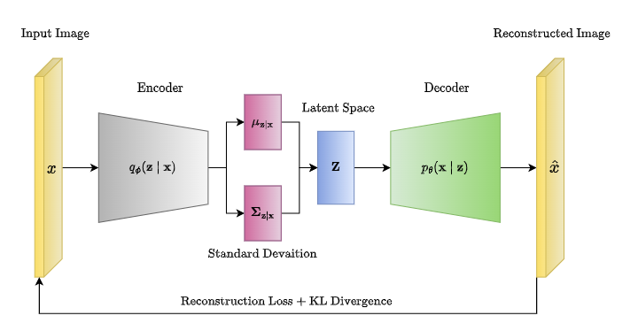
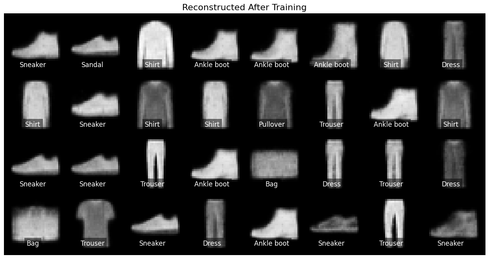
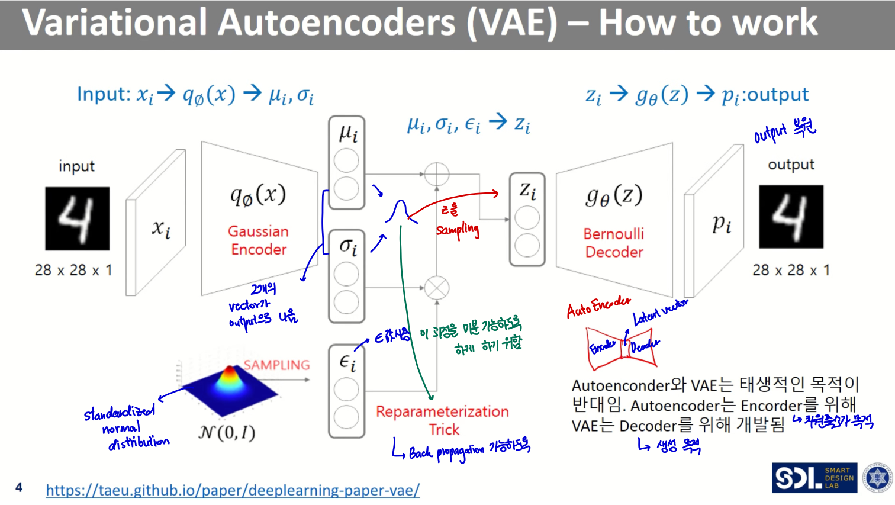

# Mastering Variational Autoencoders: Concepts, Implementation, and Applications

## Understand the Fundamental Concepts Behind Variational Autoencoders (VAEs)

Variational Autoencoders (VAEs) are a powerful class of generative models introduced by Kingma and Welling in 2013. Unlike traditional autoencoders, which map inputs to fixed latent representations, VAEs combine neural networks with probabilistic modeling to learn meaningful latent variable distributions from data. This hybrid architecture enables VAEs to generate new, diverse samples that reflect the underlying data distribution, making them widely applicable in machine learning tasks such as image synthesis, representation learning, and anomaly detection.

At their core, VAEs consist of three main components: an encoder, a decoder, and a probabilistic latent space. The encoder network maps input data to the parameters of a latent distribution--commonly modeled as a Gaussian with a mean and variance--rather than a single deterministic point. Subsequently, the decoder network reconstructs data samples by drawing stochastic samples from this latent distribution. This probabilistic mechanism ensures smooth interpolation in latent space and robust generation of new data points.


*Variational Autoencoder architecture showing encoder, latent distribution, sampling, and decoder.*

The training of VAEs revolves around variational inference, a technique for approximating complex posterior distributions. Directly computing the true posterior is intractable, so VAEs optimize the Evidence Lower Bound (ELBO), which balances two objectives: maximizing the likelihood of reconstructing the input data and minimizing the divergence between the learned latent distribution and a prior (typically a standard normal distribution). The ELBO objective can be expressed as:

\[
\mathcal{L}_{ELBO} = \mathbb{E}_{q_{\phi}(z|x)}[\log p_{\theta}(x|z)] - D_{KL}(q_{\phi}(z|x) \| p(z))
\]

where \(q_{\phi}(z|x)\) is the approximate posterior from the encoder, \(p_{\theta}(x|z)\) is the decoder likelihood, and \(D_{KL}\) is the Kullback-Leibler divergence encouraging the latent distribution to stay close to the prior.

What sets VAEs apart from traditional autoencoders is this explicit modeling of latent variables as probability distributions, combined with stochastic sampling during training. Traditional autoencoders compress data into fixed latent vectors without probabilistic interpretation, limiting their generative capabilities. In contrast, VAEs' stochastic nature allows them to capture data variability more effectively and generate realistic, novel samples by sampling from the learned latent space.

Understanding these conceptual fundamentals of VAEs lays the groundwork for implementing and experimenting with them, especially when exploring recent advances and practical applications in 2024 and beyond. For a comprehensive overview, see sources like [GeeksforGeeks](https://www.geeksforgeeks.org/machine-learning/variational-autoencoders) and [IBM](https://www.ibm.com/think/topics/variational-autoencoder).

## Explore the Mathematical Formulation and Training Objectives of VAEs

Variational Autoencoders (VAEs) are grounded in a probabilistic framework that enables efficient generative modeling by approximating complex data distributions. At their core, VAEs aim to learn a latent representation \( \mathbf{z} \) of observed data \( \mathbf{x} \) such that new samples can be generated by sampling from the latent space. This involves defining a likelihood model \( p_\theta(\mathbf{x}|\mathbf{z}) \) parameterized by \(\theta\), a prior distribution \( p(\mathbf{z}) \) over the latent variables, and an approximate posterior \( q_\phi(\mathbf{z}|\mathbf{x}) \) parameterized by \(\phi\) that serves as a tractable surrogate for the true, often intractable, posterior \( p_\theta(\mathbf{z}|\mathbf{x}) \).

The key training objective for VAEs arises from variational inference, where the goal is to maximize the marginal likelihood \( p_\theta(\mathbf{x}) = \int p_\theta(\mathbf{x}|\mathbf{z}) p(\mathbf{z}) d\mathbf{z} \). Direct optimization is intractable due to the integral over latent variables, so VAEs maximize a lower bound on the log-likelihood known as the Evidence Lower BOund (ELBO). The ELBO can be derived as follows:

\[
\log p_\theta(\mathbf{x}) \geq \mathbb{E}_{q_\phi(\mathbf{z}|\mathbf{x})} \big[ \log p_\theta(\mathbf{x}|\mathbf{z}) \big] - \mathrm{KL}\big(q_\phi(\mathbf{z}|\mathbf{x}) \,||\, p(\mathbf{z})\big)
\]

This decomposition balances two terms:
- **Reconstruction term**: \( \mathbb{E}_{q_\phi(\mathbf{z}|\mathbf{x})} [ \log p_\theta(\mathbf{x}|\mathbf{z}) ] \), which encourages the decoder to reconstruct the input data accurately given a latent sample.
- **Regularization term**: \( \mathrm{KL}(q_\phi(\mathbf{z}|\mathbf{x}) \,||\, p(\mathbf{z})) \), which acts as a regularizer encouraging the approximate posterior to stay close to the prior, often chosen as a standard normal distribution.

Combining these terms gives the VAE loss function to be minimized during training:

\[
\mathcal{L}(\theta, \phi; \mathbf{x}) = -\mathbb{E}_{q_\phi(\mathbf{z}|\mathbf{x})} \big[ \log p_\theta(\mathbf{x}|\mathbf{z}) \big] + \mathrm{KL}\big(q_\phi(\mathbf{z}|\mathbf{x}) \,||\, p(\mathbf{z}) \big)
\]

Here, the first term corresponds to the **reconstruction loss**, often implemented as a pixel-wise binary cross-entropy or mean squared error, and the second term is the **KL divergence loss**. Minimizing this loss encourages the model to produce outputs faithful to inputs while ensuring latent variables approximate the prior distribution, enabling smooth generative sampling.

Optimizing this objective involves challenges such as balancing the two loss terms. One widely used technique is **KL annealing**, where the KL divergence term is gradually increased from zero to its full weight over training epochs. This helps avoid posterior collapse, a situation where the latent variables are ignored and the decoder behaves like a standard autoencoder, losing generative capabilities. Other optimization methods include using the reparameterization trick to enable gradient backpropagation through stochastic sampling of \(\mathbf{z}\) and applying advanced optimizers like Adam for stable convergence.

Understanding these mathematical foundations equips you to appreciate how VAEs blend probabilistic inference and neural networks to perform powerful generative modeling, setting the stage for their versatile applications in image generation, anomaly detection, and beyond ([Source](https://en.wikipedia.org/wiki/Variational_autoencoder)).

## Implement a Basic Variational Autoencoder in Python Using PyTorch

To gain hands-on experience with Variational Autoencoders (VAEs), let's implement a simple model trained on the Fashion-MNIST dataset. This section walks through preparing the data, defining the encoder and decoder networks, applying the reparameterization trick, writing the training loop with the Evidence Lower Bound (ELBO) loss, and evaluating the reconstruction capabilities.

### 1. Data Preprocessing

We begin by loading the Fashion-MNIST dataset via `torchvision`, normalizing the images to the [0,1] range, and setting up data loaders for efficient batch processing.

```python
import torch
from torchvision import datasets, transforms
from torch.utils.data import DataLoader

# Transformation: convert images to tensors and normalize
transform = transforms.ToTensor()

# Download and load the training data
train_dataset = datasets.FashionMNIST(root='./data', train=True, download=True, transform=transform)
train_loader = DataLoader(dataset=train_dataset, batch_size=128, shuffle=True)
```

### 2. Define Encoder and Decoder Architectures

A VAE consists of an encoder network that maps input images to parameters of the latent distribution (mean and log-variance) and a decoder network that reconstructs images from latent samples. We use simple fully connected layers for demonstration.

```python
import torch.nn as nn
import torch.nn.functional as F

class Encoder(nn.Module):
    def __init__(self, latent_dim=20):
        super(Encoder, self).__init__()
        self.fc1 = nn.Linear(28*28, 400)
        self.fc_mu = nn.Linear(400, latent_dim)
        self.fc_logvar = nn.Linear(400, latent_dim)

    def forward(self, x):
        x = x.view(-1, 28*28)
        h = F.relu(self.fc1(x))
        mu = self.fc_mu(h)
        logvar = self.fc_logvar(h)
        return mu, logvar

class Decoder(nn.Module):
    def __init__(self, latent_dim=20):
        super(Decoder, self).__init__()
        self.fc1 = nn.Linear(latent_dim, 400)
        self.fc2 = nn.Linear(400, 28*28)

    def forward(self, z):
        h = F.relu(self.fc1(z))
        out = torch.sigmoid(self.fc2(h))
        return out.view(-1, 1, 28, 28)
```

### 3. Reparameterization Trick

To backpropagate through the sampling step, we apply the reparameterization trick: sample from a standard normal and shift/scale by the latent parameters.

```python
def reparameterize(mu, logvar):
    std = torch.exp(0.5 * logvar)
    eps = torch.randn_like(std)
    return mu + eps * std
```

### 4. Training Loop with ELBO Loss

The loss function combines a reconstruction term (binary cross-entropy) and a KL divergence term measuring the divergence between the learned latent distribution and the prior (standard normal). Training optimizes this loss.

```python
optimizer = torch.optim.Adam(list(encoder.parameters()) + list(decoder.parameters()), lr=1e-3)

def loss_function(recon_x, x, mu, logvar):
    BCE = F.binary_cross_entropy(recon_x, x, reduction='sum')
    KLD = -0.5 * torch.sum(1 + logvar - mu.pow(2) - logvar.exp())
    return BCE + KLD

encoder = Encoder()
decoder = Decoder()
encoder.train()
decoder.train()

epochs = 10
for epoch in range(epochs):
    train_loss = 0
    for batch_idx, (data, _) in enumerate(train_loader):
        optimizer.zero_grad()
        mu, logvar = encoder(data)
        z = reparameterize(mu, logvar)
        recon_batch = decoder(z)
        loss = loss_function(recon_batch, data, mu, logvar)
        loss.backward()
        train_loss += loss.item()
        optimizer.step()

    print(f'Epoch {epoch+1}, Average Loss: {train_loss / len(train_loader.dataset):.4f}')
```

### 5. Evaluate Reconstruction Quality

Finally, let's visualize original versus reconstructed images to assess qualitative reconstruction performance.

```python
import matplotlib.pyplot as plt

encoder.eval()
decoder.eval()

with torch.no_grad():
    sample_data, _ = next(iter(train_loader))
    mu, logvar = encoder(sample_data)
    z = reparameterize(mu, logvar)
    recon = decoder(z)

fig, axes = plt.subplots(2, 8, figsize=(12, 4))
for i in range(8):
    axes[0, i].imshow(sample_data[i][0], cmap='gray')
    axes[0, i].axis('off')
    axes[0, i].set_title('Original')

    axes[1, i].imshow(recon[i][0], cmap='gray')
    axes[1, i].axis('off')
    axes[1, i].set_title('Reconstructed')

plt.show()
```


*Comparison of original and reconstructed images from the Fashion-MNIST dataset using a trained Variational Autoencoder.*

Optionally, latent space interpolation or sampling from the prior can reveal the generative capabilities of the VAE latent space, encouraging deeper experimentation.

This straightforward example lays the foundation to expand VAEs with convolutional layers, conditional inputs, or more complex datasets, helping strengthen intuition behind variational inference and generative modeling in PyTorch.

## Advanced VAE Variants and Improvements Developed Up to Mid-2026

As variational autoencoders (VAEs) have matured, numerous extensions and enhancements have emerged to address key challenges such as controllable data generation, disentangled representations, discrete latent spaces, and improved stability of training. These advanced variants not only push the boundaries of VAE capabilities but also broaden their applicability across domains--particularly in image generation and biomedical data analysis--through 2024 and 2025 research breakthroughs.

### Conditional VAEs (CVAEs): Controlled Generation

Conditional VAEs introduce conditional variables into the latent space, allowing the generation process to be influenced by auxiliary information such as labels or attributes. Unlike standard VAEs, which produce samples from an unconditional distribution, CVAEs enable control over specific features in the output. By incorporating conditions \( y \) alongside input data \( x \) during training, CVAEs learn the posterior \( q_\phi(z|x,y) \) and decoder \( p_\theta(x|z,y) \), facilitating targeted synthesis. This makes them especially powerful in tasks needing tailored generation, such as generating images of specific classes or with defined styles. CVAEs have shown significant promise in image synthesis scenarios and text generation, yielding higher fidelity and diversity in reconstructed samples ([source](https://www.itm-conferences.org/articles/itmconf/abs/2025/01/itmconf_dai2024_02001/itmconf_dai2024_02001.html)).

### InfoVAEs and -VAEs: Steering Disentanglement and Representation Quality

Two prominent approaches aimed at improving disentanglement and latent representation learning are InfoVAEs and -VAEs. -VAEs introduce a hyperparameter \( \beta \) to the Kullback-Leibler divergence term in the loss function, effectively controlling the trade-off between reconstruction accuracy and the level of disentanglement in the latent space. Higher  values encourage the model to learn independent and interpretable latent factors but may reduce reconstruction fidelity. InfoVAEs refine this idea by balancing mutual information between observed data and latent variables, mitigating issues of overly simplistic latent encodings. These models have been instrumental in enabling interpretable, factorized latent representations that improve downstream tasks like clustering and anomaly detection ([source](https://thesciencebrigade.com/adlt/article/view/115)).

### Vector Quantized VAEs (VQ-VAEs): Discrete Latent Spaces

Standard VAEs operate with continuous latent variables, but VQ-VAEs introduce a discrete latent embedding space using vector quantization. This discretization yields more efficient representations and has been successful in tasks like speech synthesis, image modeling, and reinforcement learning, where discrete codes facilitate compositionality and better alignment with symbolic reasoning. The discrete bottleneck in VQ-VAEs has also enhanced sample quality, producing sharper and more coherent outputs in complex domains such as high-resolution image generation ([source](https://www.itm-conferences.org/articles/itmconf/abs/2025/01/itmconf_dai2024_02001/itmconf_dai2024_02001.html)).

### Recent Architectures and Training Techniques

Advances in VAE architectures and optimization schemes through 2024-2025 have further enhanced model stability and sample quality. Techniques such as hierarchical latent structures, improved posterior approximations via normalizing flows, and hybrid loss functions combining adversarial objectives with variational losses have collectively addressed common VAE pitfalls like blurry reconstructions and mode collapse. Moreover, training protocols incorporating cyclic annealing schedules for the KL term and novel initialization strategies have bolstered robustness and convergence speed.

### Research Insights: Applications in Image Generation and Biomedical Data

Recent studies highlight the effectiveness of these VAE variants in real-world applications. In image generation, integrating CVAEs and VQ-VAEs has substantially uplifted the diversity and fidelity of generated samples, enabling applications in art creation, data augmentation, and style transfer ([source](https://www.itm-conferences.org/articles/itmconf/abs/2025/01/itmconf_dai2024_02001/itmconf_dai2024_02001.html)). Meanwhile, in biomedical informatics, enhanced VAEs have facilitated interpretable feature extraction from complex datasets, such as multi-omics profiles and medical imaging, boosting predictive analytics and disease subtype identification ([source](https://bibbase.org/service/mendeley/bfbbf840-4c42-3914-a463-19024f50b30c/file/65d757ce-c558-08bf-028d-2f9b14cd54b2/Recent_Advances_in_Variational_Autoencoders_With_Representation_Learning_for_Biomedical_Informatics_A_Survey.pdf.pdf)).

In summary, 2024-2026 have been pivotal years for VAEs, with their advanced variants enriching the model's flexibility, interpretability, and practical utility across domains. As the field progresses, these improvements continue to inspire novel architectures and applications.


*Visual summary of advanced VAE variants including Conditional VAE, Beta-VAE, and Vector Quantized VAE, highlighting their key features and applications.*

## Practical Applications of VAEs in Image Generation, Biomedical Informatics, and Anomaly Detection

Variational Autoencoders (VAEs) have emerged as powerful tools across diverse domains due to their ability to learn meaningful latent representations and generate new data samples. Their versatility is well demonstrated in image generation, biomedical informatics, and anomaly detection applications.

### Image Generation and Enhancement

VAEs play a critical role in creating high-quality, diverse images by learning compact latent spaces that capture the underlying data distribution. Unlike traditional generative models, VAEs balance reconstruction fidelity with smooth latent space regularization, enabling the synthesis of novel yet coherent images. Recent advances have shown VAEs generating photorealistic images in facial synthesis, art creation, and style transfer scenarios. Furthermore, VAEs assist in image enhancement tasks such as super-resolution and denoising, where the learned latent representations allow the model to reconstruct sharper or clearer images from degraded inputs. For example, a 2025 study demonstrated enhanced fashion image generation by optimizing the VAE architecture for diversity and detail preservation, thereby improving visual variety in design prototypes ([Source](https://www.itm-conferences.org/articles/itmconf/abs/2025/01/itmconf_dai2024_02001/itmconf_dai2024_02001.html)).

### Biomedical Informatics

In biomedical informatics, VAEs address challenges related to limited data availability and noise contamination. Synthetic data generation using VAEs has been employed to augment scarce datasets, facilitating more robust training of diagnostic algorithms while preserving patient privacy. Importantly, VAEs serve as denoising tools for medical images such as MRI or CT scans, improving image quality and aiding accurate diagnosis without invasive procedures. Recent surveys highlight how VAEs implement representation learning to extract biologically meaningful features, supporting tasks like disease classification and biomarker discovery ([Source](https://bibbase.org/service/mendeley/bfbbf840-4c42-3914-a463-19024f50b30c/file/65d757ce-c558-08bf-028d-2f9b14cd54b2/Recent_Advances_in_Variational_Autoencoders_With_Representation_Learning_for_Biomedical_Informatics_A_Survey.pdf.pdf)). For instance, VAE-based models have been validated to generate synthetic chest X-rays that effectively mimic disease variations, expanding datasets for rare pathologies.

### Anomaly Detection

Anomaly detection leverages VAEs by exploiting discrepancies in reconstruction errors when inputs deviate from the learned normal data distribution. In domains such as signal processing, VAEs model normal signal patterns; abnormal or corrupted signals yield higher reconstruction loss, thus signaling anomalies. Similarly, in medical imaging, VAEs identify unusual regions indicating tumors, lesions, or other pathologies by failing to accurately reconstruct these rare features. This unsupervised approach offers scalable and flexible anomaly detection without explicit anomaly labeling, which is often costly or impractical. Recent research emphasizes improving sensitivity and specificity in detecting faults in industrial sensor data and early disease markers via VAE frameworks ([Source](https://thesciencebrigade.com/adlt/article/view/115)).

These examples collectively illustrate VAEs' impactful applications, underscoring their significance as generative and analytical tools that continue to evolve with advancing architectures and training techniques.

## Best Practices and Tips for Effectively Training and Tuning VAEs

Training variational autoencoders (VAEs) to achieve robust generative performance requires careful balancing of key factors and thoughtful hyperparameter tuning. One of the most critical aspects is managing the trade-off between the reconstruction loss and the Kullback-Leibler (KL) divergence term. Overemphasizing the KL term can lead to *posterior collapse*, where the encoder produces trivial latent representations, effectively ignoring the input data. To prevent this, consider techniques such as **KL annealing**, which gradually increases the weight of the KL term during training, allowing the model to first focus on accurate reconstruction before enforcing a smooth latent space.

Choosing the right **network architecture** and **latent space dimensionality** is dependent on your data type. For instance, convolutional layers excel with image data, capturing spatial hierarchies, whereas fully connected layers may suffice for simpler tabular data. The size of the latent space should strike a balance: too small may limit representation capacity, too large can lead to overfitting or redundant dimensions. Empirical tuning guided by validation performance is often necessary.

Additional training strategies that enhance VAE performance include **learning rate scheduling** to adaptively reduce the step size and **batch normalization** to stabilize and accelerate convergence. Combining these with KL annealing can improve stability and prevent mode collapse--a common pitfall where the model generates limited diversity in samples.

Be mindful of potential issues like **overfitting**, especially in smaller datasets, and **poor sampling fidelity** that results in blurry or unrealistic generations. Regular monitoring using evaluation metrics such as **reconstruction error** (e.g., mean squared error or binary cross-entropy) and qualitative **visual inspections** of generated samples helps diagnose and address these issues promptly.

By integrating these best practices--careful loss balancing, architecture tailoring, strategic training schedules, and vigilant evaluation--you can significantly improve the robustness and quality of your VAE models, unlocking their full potential in generative and representation learning tasks.

[Source](https://www.itm-conferences.org/articles/itmconf/abs/2025/01/itmconf_dai2024_02001/itmconf_dai2024_02001.html)

## Future Directions and Emerging Trends in Variational Autoencoder Research and Applications

As Variational Autoencoders (VAEs) continue to evolve, several promising avenues are shaping their future landscape, both in research and practical applications. A notable trend is the integration of VAEs with other deep generative models such as Generative Adversarial Networks (GANs) and normalizing flows. These hybrid architectures aim to combine the representational strengths of VAEs with GANs' sharp image generation and the exact likelihood modeling of normalizing flows, thus enhancing generative quality and diversity while mitigating their respective limitations [Source](https://www.itm-conferences.org/articles/itmconf/abs/2025/01/itmconf_dai2024_02001/itmconf_dai2024_02001.html).

Advances in semi-supervised learning and representation learning have also propelled VAEs to the forefront of biomedical informatics and other domains where labeled data is scarce. Recent surveys highlight improved latent feature disentanglement and robust feature extraction capabilities, enabling VAEs to learn meaningful, low-dimensional embeddings that aid downstream tasks such as classification and anomaly detection [Source](https://bibbase.org/service/mendeley/bfbbf840-4c42-3914-a463-19024f50b30c/file/65d757ce-c558-08bf-028d-2f9b14cd54b2/Recent_Advances_in_Variational_Autoencoders_With_Representation_Learning_for_Biomedical_Informatics_A_Survey.pdf.pdf).

Emerging use cases are now leveraging VAEs in AI-powered editing tools that offer content-aware manipulation, style transfer, and personalized generation, broadening creative possibilities. Additionally, VAEs facilitate data augmentation in scenarios with limited datasets by synthesizing realistic variations, thus improving model generalization across diverse fields [Source](https://thesciencebrigade.com/adlt/article/view/115).

On the interpretability front, efforts focus on enhancing control over latent representations, making it easier to understand and manipulate the factors of variation encoded by VAEs. This is crucial for transparency and trust in generative models, particularly in sensitive applications such as healthcare and autonomous systems.

Despite these strides, challenges remain, especially around scalability and stability when deploying VAEs in large-scale and real-time systems. Addressing these issues involves improving training techniques to stabilize optimization and developing architectures that scale efficiently without sacrificing performance.

Overall, the future of VAEs is vibrant, with ongoing research pushing toward more powerful, interpretable, and versatile generative models that unlock new frontiers across AI disciplines.

---
