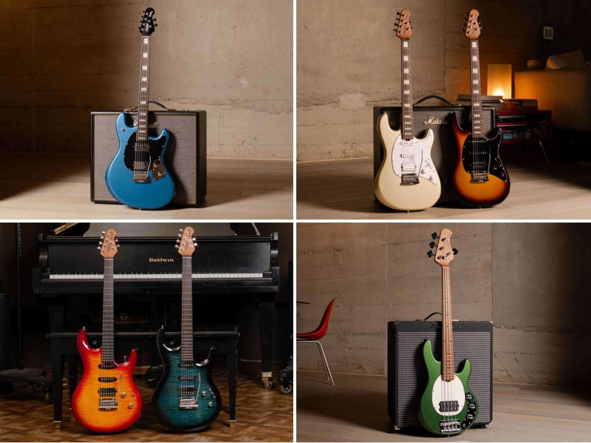
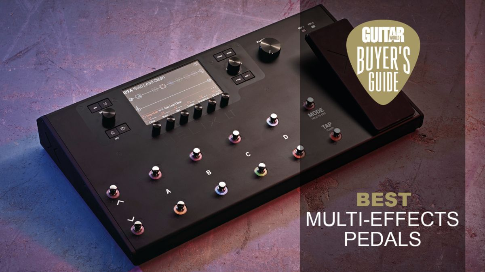

# The State of Guitars in 2026: Trends, Top Models, and Gear Innovations

## Introduce the Landscape of Guitars in 2026

The guitar market in 2026 is flourishing with a vibrant mix of growth and innovation, setting a dynamic stage for musicians across all levels. Guitar manufacturing has embraced both cutting-edge technology and a renewed focus on craftsmanship, leading to an impressive array of instruments that blend tradition with modern advancements. This year's NAMM Show and industry reports reveal that builders are pushing boundaries in materials, electronics, and design to enhance playability, tone, and versatility, reflecting an exciting evolution in guitar culture [Source](https://www.martinguitar.com/news-011926-martin-guitar-unveils-four-all-new-models-ahead-of-the-2026-namm-show.html), [Source](https://www.guitarcenter.com/riffs/news/guitars/namm-2026-acoustic-and-electric-guitars).

In 2026, guitar enthusiasts are spoiled for choice with a wide variety of guitar types dominating the scene. Traditional acoustic guitars continue to captivate players with richer tonewoods and refined body designs, while electric guitars see innovation through enhanced pickups, ergonomic shapes, and integrated digital capabilities. Alongside these staples, extended-range guitars--such as 7- and 8-string models--gain traction among progressive players seeking broader sonic palettes. Additionally, unique and hybrid models combining acoustic and electric elements or integrating effects are becoming increasingly popular, catering to diverse musical styles and creative experimentation [Source](https://www.guitarworld.com/features/best-electric-guitars).

Several major brands stand out in this flourishing market. Legendary manufacturers like Martin and Fender maintain their esteemed reputation through ongoing innovation and quality craftsmanship. Newcomers and boutique makers also wield influence by offering specialized instruments tailored to niche demands. Data-driven rankings highlight these top guitar brands leading 2026, with Martin unveiling several new models pre-NAMM, and others like Gibson, PRS, Ibanez, and Yamaha continuing to captivate with both classic designs and futuristic features [Source](https://findmyguitar.com/best-electric-guitar-brands.php), [Source](https://www.musicstreet.co.uk/blogs/blog-post/7-examples-of-guitar-brands-for-musicians).

This overview sets the foundation for deeper dives into the standout models, brand innovations, and breakthrough accessories shaping the guitar industry today. Whether you are a seasoned player, a gear collector, or a music technology enthusiast, the guitar landscape of 2026 offers something fresh and inspiring, blending heritage with the pulse of tomorrow's sound.

## Highlight Major New Guitar Models Debuting in 2026

The 2026 NAMM Show and related launches have brought an exciting wave of new guitar models, showcasing cutting-edge craftsmanship, innovative electronics, and fresh aesthetic designs. Whether you're a seasoned pro, a collector, or just starting out, this year's offerings present a wide range of instruments tailored to diverse playing styles and needs.

### Martin Guitar's Fresh Acoustic Treasures

Martin Guitar has unveiled four stunning new acoustic models, each balancing tradition with modern enhancements:

- **Super D-18**: A reimagination of Martin's classic D-18 with refined tonewoods and voicing that delivers richer midrange warmth without losing clarity. Perfect for fingerstyle players seeking articulation and dynamic range.  
- **Super HD-28**: Building on the iconic HD-28's legacy, this model features upgraded bracing techniques and tonewood pairing to enhance projection and sustain, ideal for rhythm guitarists in live or studio settings.  
- **O'ahu K-42 Hibiscus**: This ukulele model highlights Martin's foray into tropical-inspired craftsmanship, combining Hawaiian koa wood with a vibrant hibiscus motif, appealing to players looking for both an excellent tone and unique visual flair.  
- **Custom Shop M Paisley Ember Burst**: A limited-edition dazzler from Martin's Custom Shop, offering exquisite paisley inlay work coupled with an Ember Burst finish. It's designed for collectors and professional performers who want an instrument that stands out on stage and in the hands ([Source](https://www.martinguitar.com/news-011926-martin-guitar-unveils-four-all-new-models-ahead-of-the-2026-namm-show.html)).

These models showcase Martin's commitment to marrying historic design with contemporary innovations in wood treatments and bracing strategies, positioning them well for acoustic purists and modern players alike.

### Electric Guitar Innovations: PRS, Epiphone, and Fender

2026 also marks key new electric guitar introductions from top brands, each catering to distinct genres and preferences:

- **PRS SE Swamp Ash Special Iri Blue**: This new PRS model utilizes lightweight swamp ash bodies for enhanced resonance and playback comfort. Its vibrant Iri Blue finish, coupled with high-output pickups and a versatile switching system, makes it a prime choice for blues, rock, and fusion guitarists seeking both punch and versatility ([Source](https://www.guitarworld.com/features/best-electric-guitars)).  
- **Epiphone Casino Pelham Blue**: A classic hollow-body returns with a Pelham Blue finish that echoes vintage charm. Equipped with updated P-90 pickups and improved wiring, this model offers warm, yet cutting tones, perfect for indie, jazz, and retro rock players who want that authentic vintage vibe with modern reliability.  
- **Fender American Ultra II Tele**: Fender's flagship Tele model steps up with enhanced Ultra II electronics featuring noiseless pickups and a third pickup option for expanded tonal possibilities. Additionally, neck shape and fretboard radius adjustments improve playability for shredders and country stylists alike, offering a striking combination of familiarity and innovation ([Source](https://www.musicradar.com/news/the-best-electric-guitars)).

### Innovations in Construction, Electronics, and Style

Many of the 2026 model launches emphasize improvements in:

- **Construction techniques**: From advanced bracing patterns in acoustics for better sustain and projection to ultra-lightweight woods in electrics to reduce fatigue without sacrificing tone.  
- **Electronics integration**: More versatile pickup configurations, on-board preamps with tailored EQ curves, noiseless pickups, and expanded switching systems give players unprecedented control over their sound palette.  
- **Aesthetics**: Bold finishes like Ember Burst, Pelham Blue, and Iri Blue, along with intricate inlays and custom shop artistry, ensure these guitars don't just sound great--they look spectacular.

### Catering to Different Player Needs

These new models answer the call of various musicians:

- Fingerpickers and solo acoustic performers can rely on Martin's Super models for clarity and warmth in intimate or live settings.  
- Electric players seeking vintage tones with modern reliability find the Epiphone Casino Pelham Blue an enticing option.  
- Musicians needing a versatile electric with cutting-edge features can turn to the PRS SE Swamp Ash Special or Fender American Ultra II Tele for genre-spanning sounds and comfortable playability.  
- Collectors and enthusiasts are drawn to unique limited editions like the Martin Custom Shop M Paisley Ember Burst for their aesthetic and investment value.

In sum, the 2026 lineup of guitar models reflects a vibrant fusion of heritage and innovation, ensuring there's a perfect fit for every type of player advancing into the next musical frontier. Whether prioritizing tone, tech, or aesthetics, these instruments set new benchmarks for the guitar community in 2026 and beyond.

*Comparison chart of major 2026 guitar models highlighting features, materials, and intended player styles*

## Review the Best Electric Guitars for Skill Levels and Styles in 2026

Choosing the right electric guitar in 2026 involves balancing skill level, musical style, tonewood quality, playability, and budget. Expert consensus highlights standout models across beginner, intermediate, and professional tiers, each tailored to different genres and preferences.

For beginners, the **Harley Benton Fusion-II HH FR** offers outstanding value. Praised for its solid construction and versatility, it features quality tonewoods that deliver a clear, balanced sound. Its comfortable neck and reliable hardware make it an ideal starter guitar, especially for players exploring blues, rock, or metal. The Fusion-II's price point lowers the barrier for newcomers without compromising essential playability ([University of Rock](https://universityofrock.com/best-electric-guitars-under-1000)).

At the intermediate level, the **PRS SE Silver Sky** stands out. A collaboration with John Mayer, this guitar blends vintage-inspired aesthetics with modern playability. It uses premium tonewoods and upgraded pickups to offer a rich, articulate tone suited for genres like indie, pop, and blues. Players benefit from its balanced neck profile, which supports expressive playing and technical growth. Its moderate price makes it accessible for serious hobbyists aiming to elevate their sound ([Guitar World](https://www.guitarworld.com/features/best-electric-guitars)).

Professionals seeking top-tier instruments often turn to the **Fender American Ultra II Stratocaster HSS** and the **Gibson Les Paul Studio Session**. The Fender Ultra II combines innovative pickups and a refined neck for exceptional versatility, fitting for styles from jazz to hard rock. It boasts premium tonewoods and advanced hardware, ensuring durability and rich dynamics. Meanwhile, the Gibson Les Paul Studio Session caters to players who favor classic rock and blues tones, featuring mahogany construction with maple tops for warmth and sustain. Both models command higher price points but deliver superior craftsmanship and sonic flexibility ([MusicRadar](https://www.musicradar.com/news/the-best-electric-guitars)).

When selecting a guitar, consider how your preferred genres align with tonewood and pickup configurations. For example, alder or ash bodies typically excel in bright, punchy sounds suitable for funk and pop, while mahogany adds warmth favored in rock and blues. Neck profiles and fretboard radii also impact playability, especially important for beginners gaining finger strength or pros executing fast solos.

In summary, the best guitar for you balances comfort, sound, and budget: start simple with models like the Harley Benton Fusion-II, grow into versatile instruments such as the PRS SE Silver Sky, and invest in premium craftsmanship with Fender or Gibson once your style and skill mature. This approach ensures your electric guitar supports your musical journey in 2026 and beyond.

*Diagram showing recommended electric guitars categorized by beginner, intermediate, and professional skill levels with genre/style suitability*

## Explore Popular Guitar Brands and Their Unique Selling Points in 2026

The guitar landscape in 2026 is shaped by a blend of heritage craftsmanship and cutting-edge innovation. Iconic brands like Fender, Gibson, PRS, Ibanez, Gretsch, Yamaha, and Martin continue to lead the charge, each with distinct identities that appeal to diverse players and genres.

**Fender** remains synonymous with the classic American electric guitar sound, famed for its Stratocaster and Telecaster models. The brand's signature features include sleek contoured bodies, single-coil pickups, and versatile tonal ranges ideal for blues, rock, and country. In 2026, Fender has embraced modern tech by incorporating noiseless pickups and integrating Bluetooth connectivity in select models, enhancing practice and recording convenience without losing their vintage vibe ([Guitar World](https://www.guitarworld.com/features/best-electric-guitars)).

**Gibson**, with its legendary Les Paul and SG lines, emphasizes warmth, sustain, and powerful humbucking pickups, making it a favorite for rock and metal guitarists. Recent innovations involve lightweight body designs using new composite materials and upgraded electronics that preserve Gibson's rich tone while improving player comfort and feedback resistance ([GuitarCenter](https://www.guitarcenter.com/NAMM-New-Arrivals.gc)).

**PRS (Paul Reed Smith)** blends high-end craftsmanship with modern versatility. Known for immaculate finishes and figured maple tops, PRS guitars appeal across genres from jazz to hard rock. In 2026, PRS introduced multi-voice pickups and refined ergonomic contours, reflecting their philosophy of marrying aesthetics with performance innovation ([MusicRadar](https://www.musicradar.com/news/the-best-electric-guitars)).

Japanese powerhouse **Ibanez** holds a strong reputation among shred and metal players for fast neck profiles and versatile pickup configurations. Their experimental offerings feature enhanced tremolo systems for expressiveness. Ibanez also continues to lead in offering affordable yet feature-rich models, balancing technical prowess and accessibility ([FindMyGuitar](https://findmyguitar.com/best-electric-guitar-brands.php)).

**Gretsch** stands out with its distinct hollow and semi-hollow designs, double-cutaway bodies, and Filter'Tron pickups, prized in rockabilly, jazz, and country circles. Their 2026 models have integrated sustainable tonewoods and refined coil-splitting electronics, honoring tradition while embracing eco-consciousness and tonal flexibility ([GuitarCenter](https://www.guitarcenter.com/riffs/news/guitars/namm-2026-acoustic-and-electric-guitars)).

**Yamaha** continues its dual focus on quality acoustic and electric guitars with consistent value and playability. Known for innovation in electronics, Yamaha has expanded piezo pickup options and onboard processors this year, catering especially to gigging musicians seeking reliable, stage-ready instruments ([MusicStreet](https://www.musicstreet.co.uk/blogs/blog-post/7-examples-of-guitar-brands-for-musicians)).

Finally, **Martin Guitar**, revered for its premium acoustic craftsmanship, unveiled four all-new models at NAMM 2026, showcasing their commitment to sustainability and tone enhancement through innovative bracing patterns and Select Tonewoods™. These models reflect Martin's philosophy of honoring traditional acoustic sounds while pushing acoustic guitar design forward ([Martin Guitar](https://www.martinguitar.com/news-011926-martin-guitar-unveils-four-all-new-models-ahead-of-the-2026-namm-show.html)).

The evolution across these brands illustrates how legends in guitar manufacturing balance their hallmark traits--whether it's Fender's twang, Gibson's warmth, or Martin's acoustic elegance--with modern materials, electronics, and player-centric features. This fusion allows musicians from beginners to professionals to find instruments finely tuned to their style and sonic vision in 2026.

## Detail Innovations and Trends in Guitar Construction and Electronics

The guitar landscape in 2026 showcases remarkable advancements in both construction materials and integrated electronics, driven by a blend of sustainability concerns and cutting-edge technology. Manufacturers are embracing new tonewoods and sustainable alternatives while pushing the boundaries of playability and sound customization.

### Advances in Tonewoods and Sustainable Materials

Eco-consciousness continues to shape guitar manufacturing. Leading brands have introduced guitars crafted from responsibly sourced and reclaimed woods, as well as alternative materials that replicate the tonal qualities of traditional tonewoods. For example, Martin Guitar's 2026 lineup features innovative use of sustainable mahogany and rich-sounding urban woods, reducing reliance on endangered species while preserving sublime acoustic properties ([Source](https://www.martinguitar.com/news-011926-martin-guitar-unveils-four-all-new-models-ahead-of-the-2026-namm-show.html)). Additionally, some models employ engineered wood composites that enhance durability without compromising resonance, offering environmentally friendlier options without sacrificing tone.

### Improvements in Guitar Electronics

Electronics have become more seamlessly integrated and versatile. Modern guitars now often include built-in effects such as reverb, delay, and overdrive that are easily toggled via onboard controls, dramatically expanding sonic possibilities without the need for external pedals. Furthermore, "plug-and-play" interfaces that allow direct USB connectivity or Bluetooth streaming to computers and mobile devices have become mainstream, simplifying home recording and live rig setups. Pickup technology has seen advancements too--multi-voice and AI-adaptive pickups dynamically adjust their output to match playing style and environment, delivering consistent tone across genres. This integration of smart electronics makes guitars not just instruments but powerful, connected tools for musicians ([Source](https://www.musicradar.com/music-tech/the-best-new-guitar-gear-of-namm-2026)).

### Ergonomic Design and Playability Enhancements

Ergonomics also receive significant attention in 2026 models. New body contours improve comfort for extended playing sessions, with carefully sculpted heel joints allowing easier upper fret access. Lightweight designs balance structural integrity with reduced fatigue, frequently featuring chambered bodies and slim neck profiles. Some manufacturers experiment with modular components such as adjustable neck angles and custom fretboard radii catering to individual preferences. These refinements respond both to the needs of professional performers who demand durability and effortless playability, and to beginners seeking approachable instruments ([Source](https://www.guitarworld.com/features/best-electric-guitars)).

### Exemplary 2026 Model Innovations

Recent product launches exemplify these trends vividly. Martin Guitar's new models integrate sustainable wood choices alongside upgraded Fishman electronics featuring onboard phrase loops and tap tempo functions, delivering creative flexibility with an eco-focus ([Source](https://www.martinguitar.com/news-011926-martin-guitar-unveils-four-all-new-models-ahead-of-the-2026-namm-show.html)). Meanwhile, electric guitar brands showcased at NAMM 2026 introduced guitars with holistic systems--combining lightweight, ergonomic molds and cutting-edge multi-voiced pickups--with full digital connectivity for seamless integration into modern digital audio workstations ([Source](https://www.guitarcenter.com/riffs/news/guitars/namm-2026-acoustic-and-electric-guitars)). These innovations mark 2026 as a pivotal year that balances tradition, technology, and sustainability in guitar design.

## Recommend the Best Guitar Pedals and Multi-Effects for 2026

As guitar technology advances, 2026 brings an exciting range of pedals and multi-effects units designed to expand tonal possibilities and enhance creative expression. Whether you're a bedroom shredder, stage performer, or studio pro, the latest gear offers unmatched sonic flexibility and intuitive control.

### Top Multi-Effects Pedals of 2026

Leading the pack in multi-effects are the **Hologram Chroma Console**, **TC Electronic Plethora X5**, **Boss GT-1000 Core**, and **Line 6 Helix HX Effects**. The Chroma Console is celebrated for its modular design and ultra-low latency, allowing users to build custom rigs with various high-quality effects. TC Electronic's Plethora X5 shines through its vast library of pedals and intelligent footswitch configuration, making it ideal for live use. Boss's GT-1000 Core packs amp modeling and effects in a compact form, perfect for players seeking pro sounds without bulk. Meanwhile, Line 6 Helix HX Effects offers studio-level processing power with dedicated footswitches, catering to tone junkies desiring extensive signal chain control [Source](https://www.guitarplayer.com/gear/best-multi-effects-pedals).

### Popular Single Pedals to Know

For those who prefer distinct stompboxes, 2026 favorites include the **Musontek GRRR Monster** and the classic **Boss XS-100**. The GRRR Monster is a versatile fuzz pedal prized for its rich, animated tones and user-friendly tweaks. The Boss XS-100, an upgrade to a timeless design, offers stable performance and traditional overdrive sounds favored by many pros [Source](https://musontek.com/what-are-the-best-guitar-pedals-for-2026).

### Advantages of These Pedals

These pedals and multi-effects units provide immense tonal flexibility, letting guitarists sculpt sounds from warm vintage warmth to aggressive modern distortion, plus delays, reverbs, modulation, and more. Their advanced control systems--ranging from configurable footswitches to mobile app integration--enable quick adjustments on stage or in the studio. Multi-effects units consolidate multiple effects, reducing pedalboard clutter while offering presets that can be instantly recalled.

### Tips for Choosing the Right Pedal Setup

When selecting gear, consider your playing style and performance context. If you're a gigging player needing versatility and fast switching, a multi-effects unit like the Boss GT-1000 Core or TC Plethora X5 is ideal. Soloists craving signature tones might prefer single pedals like the Musontek GRRR Monster for its distinctive fuzz flavor. Also, think about connectivity--MIDI, expression pedal support, and software compatibility can future-proof your setup. Ultimately, testing gear to match your sound preferences and workflow remains key.

By combining cutting-edge technology with player-centric features, 2026's guitar pedals and multi-effects units represent powerful tools to enrich your musical journey.

*Visual summary of top guitar pedals and multi-effects devices with feature highlights and use cases*

## Guide to Buying a Guitar in 2026: Tips and Considerations

When buying a guitar in 2026, several important factors can help you make the right choice tailored to your needs and preferences. First, consider your **budget** carefully--guitars today range from affordable beginner models under $500 to premium custom shop instruments that can cost thousands. Next, define your **playing style** and **desired sound**: are you into blues, rock, metal, jazz, or fingerstyle acoustic? This will guide whether you should prioritize specific features like pickup types, tonewoods, or body shapes.

One of the fundamental decisions is choosing between an **acoustic or electric guitar**. Acoustic guitars offer the organic, unplugged tone ideal for many genres, especially with the latest 2026 models that feature improved tonewoods and bracing techniques for enhanced resonance ([Martin Guitar unveils new acoustics](https://www.martinguitar.com/news-011926-martin-guitar-unveils-four-all-new-models-ahead-of-the-2026-namm-show.html)). Electric guitars, meanwhile, offer a vast soundscape thanks to modern pickups, wireless connectivity, and expanded tonal control found in many new releases showcased at NAMM 2026 ([Guitar Center's NAMM new arrivals](https://www.guitarcenter.com/NAMM-New-Arrivals.gc)).

Deciding between **new, used, or custom shop guitars** depends on your priorities. New guitars guarantee the latest tech innovations, factory warranty, and pristine condition. Used guitars can offer extraordinary value and vintage character but require careful inspection. Custom shop instruments provide a personalized experience with hand-selected materials and bespoke appointments--a worthwhile investment if you want something truly unique.

In 2026, **innovations like integrated smart tuners, multi-voice pickups, and lightweight carbon fiber necks** are shaping purchasing decisions. These features improve playability, stability, and versatility, making certain modern guitars much easier to maintain and more adaptable to different genres and environments ([MusicRadar's best electric guitars 2026](https://www.musicradar.com/news/the-best-electric-guitars)).

Finally, when shopping, trust **established retailers** like Guitar Center, GuitarGuitar, and specialized local shops that offer expert guidance and hands-on trial opportunities. Online resources such as comprehensive reviews on Guitar World and MusicRadar also provide valuable insights into the latest models, helping you make an informed purchase from the comfort of home.

By considering budget, playing style, guitar type, and 2026's emerging technologies, you can find the perfect guitar to inspire your music for years to come.