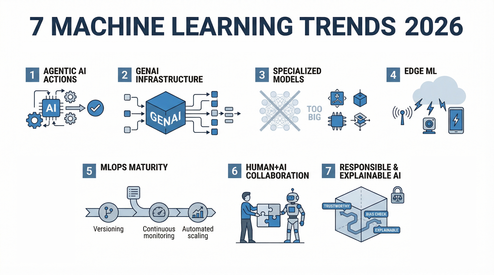
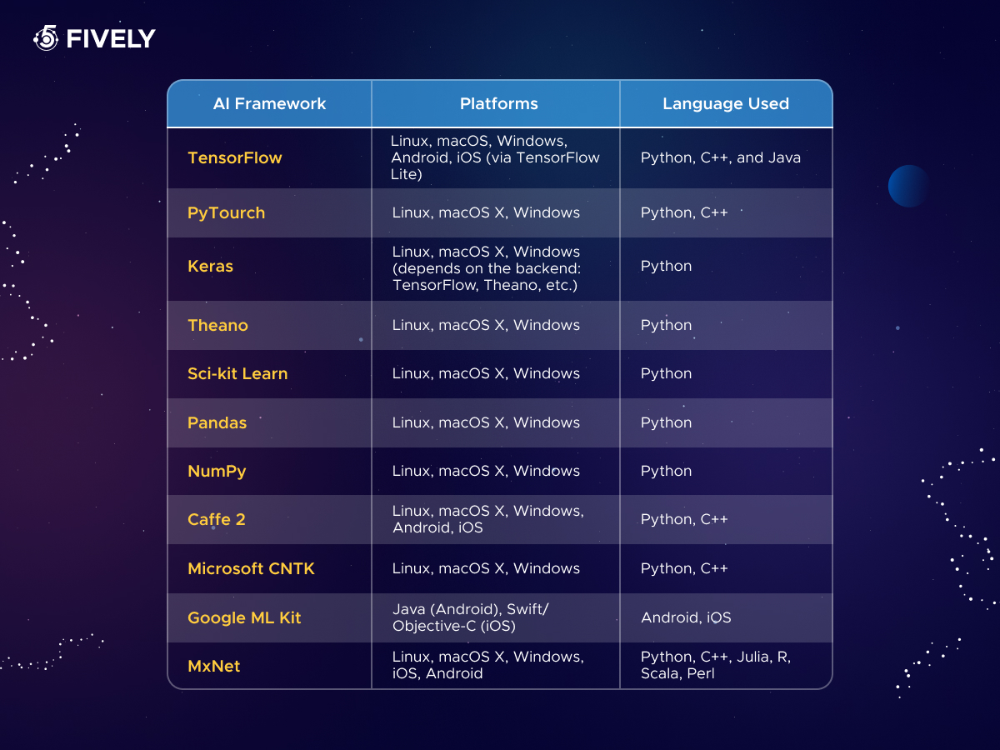

# Top Machine Learning Trends and Tools in 2026: A Practical Guide

## Introduce the Latest Machine Learning Trends in 2026

As we advance into 2026, several cutting-edge trends are shaping the landscape of machine learning (ML), influencing how enterprises design, deploy, and scale AI-powered solutions. Understanding these key developments can help practitioners and decision-makers align their strategies with technological realities and emerging opportunities.

One of the most prominent trends is the rise of **generative AI**, which leverages models capable of creating new content such as text, images, or code. Alongside this, **agentic AI** systems are gaining traction; these autonomous agents not only generate outputs but also actively make decisions and execute actions, effectively functioning as AI collaborators in workflows. Complementing these are advances in **federated learning** -- techniques enabling decentralized model training across multiple devices or silos without compromising data privacy -- and **edge AI**, which brings machine intelligence closer to data sources by running ML models locally on edge devices for improved latency and security [Source](https://tblocks.com/articles/machine-learning-trends).

A defining shift in 2026 is the **convergence of generative and predictive models** within enterprise systems. Instead of separate silos, these hybrid architectures blend generative capabilities with traditional predictive analytics to enhance decision-making processes, automate content generation, and deliver more personalized, context-aware solutions [Source](https://www.techtarget.com/searchenterpriseai/tip/9-top-AI-and-machine-learning-trends).

At the same time, the industry is recognizing the critical need for **explainable AI (XAI)**. As regulatory pressures and ethical considerations intensify, enterprises prioritize models that are transparent, interpretable, and auditable to build trust with users and ensure compliance with emerging governance frameworks [Source](https://www.ibm.com/think/news/ai-tech-trends-predictions-2026).

Another notable evolution is the **rise of smaller, domain-specific AI models** tuned for particular tasks or industries, supplanting reliance on large, generic models. These specialized models are more efficient, easier to deploy, and often deliver superior performance within their contexts, reflecting a move toward modular, adaptable AI ecosystems [Source](https://softteco.com/blog/machine-learning-trends).

Finally, **MLOps (Machine Learning Operations)** continues to expand, emphasizing automation, monitoring, and lifecycle management of ML models in production. The advent of **autonomous ML systems** that can self-tune, retrain, and optimize pipelines is significantly improving workflow efficiency, reducing time to market, and enhancing model robustness [Source](https://kanerika.com/blogs/machine-learning-use-cases).

Together, these trends paint a dynamic picture of machine learning's future in 2026 -- one defined by smarter, more interpretable, and operationally seamless AI solutions that empower enterprises to innovate with confidence.

*Key Machine Learning Trends in 2026*

## Explore Key Machine Learning Use Cases Transforming Industries in 2026

Machine learning (ML) continues to revolutionize industries by driving efficiency, reducing costs, and enabling personalized experiences. In 2026, practitioners and decision-makers are increasingly leveraging ML to address complex challenges across diverse sectors. Below, we explore some of the most impactful use cases shaping industry transformation.

**Demand Forecasting and Predictive Maintenance**  
Retailers use ML models to forecast demand with higher accuracy, optimizing inventory and minimizing waste. Similarly, manufacturers implement predictive maintenance algorithms to anticipate equipment failures, reducing downtime and maintenance costs. These applications improve operational efficiency and asset utilization by enabling proactive decision-making rather than reactive responses [Source](https://kanerika.com/blogs/machine-learning-use-cases).

**Cybersecurity Threat Detection with AI-Enhanced Edge Computing**  
With cyber threats evolving rapidly, ML-powered detection systems analyze network traffic and behaviors in real time. Edge computing enriched by AI allows such models to operate closer to data sources, enhancing responsiveness and reducing latency. This approach strengthens security postures by quickly detecting and mitigating sophisticated attacks before they propagate [Source](https://www.techtarget.com/searchenterpriseai/tip/9-top-AI-and-machine-learning-trends).

**Sustainable Energy Management and Drug Discovery**  
ML aids sustainable energy initiatives by optimizing grid operations and forecasting renewable energy outputs. Intelligent models balance power demand and supply dynamically, contributing to reduced carbon footprints. In healthcare, ML accelerates drug discovery by predicting molecular interactions and identifying promising compounds, thus shortening research cycles and lowering costs [Source](https://www.ibm.com/think/news/ai-tech-trends-predictions-2026).

**Logistics Optimization Through Route Planning and Defect Detection**  
In logistics, machine learning enhances route planning by factoring in real-time traffic, weather, and delivery constraints to minimize delays and fuel consumption. Manufacturing lines deploy ML-powered defect detection systems using computer vision to identify faults early, ensuring higher product quality and reducing waste [Source](https://kanerika.com/blogs/machine-learning-use-cases).

**Benefits: Efficiency, Cost-Savings, and Personalization**  
These use cases underscore ML's value in automating complex tasks, cutting operational expenses, and enabling tailored user experiences. Companies adopting these technologies in 2026 see measurable improvements in productivity and customer satisfaction, driving competitive advantage in rapidly evolving markets.

By examining these practical applications, ML practitioners can draw inspiration for integrating advanced models and frameworks into their own projects, aligning with the latest trends shaping the future of intelligent systems.

## Compare Popular Machine Learning Frameworks and Libraries in 2026

Choosing the right machine learning framework or library is critical for building efficient, scalable, and maintainable ML solutions. In 2026, several established and emerging tools dominate different domains and use cases. This section provides a concise comparison of top frameworks and libraries to help practitioners make informed choices based on their project needs.

### Core General-Purpose Frameworks: TensorFlow, PyTorch, and Scikit-learn

- **TensorFlow** remains a highly versatile framework, widely adopted for deep learning and production-grade ML systems. Its ecosystem supports extensive scalability through TensorFlow Extended (TFX) and TensorFlow Serving, making it ideal for enterprise deployments and complex model training pipelines [Source](https://www.ibm.com/think/machine-learning).

- **PyTorch** continues to lead in research and prototyping due to its dynamic computation graph and user-friendly Pythonic interface. It excels in flexibility, especially for cutting-edge deep learning applications and experimentation in academia and industry [Source](https://tblocks.com/articles/machine-learning-trends).

- **Scikit-learn** is the go-to for traditional machine learning techniques like classification, regression, and clustering on tabular and small-to-medium datasets. Its simplicity and robust set of algorithms make it ideal for foundational ML workflows and rapid development [Source](https://mljar.com/blog/essential-python-libraries-data-science).

### NLP-Specific Frameworks: Hugging Face Transformers, spaCy, and JAX

- **Hugging Face Transformers** has become the de facto standard for building state-of-the-art natural language processing models, offering extensive pre-trained models for tasks like text classification, summarization, and question answering. Its active community and integration with PyTorch and TensorFlow enhance its versatility [Source](https://labelstud.io/learningcenter/what-are-the-best-machine-learning-frameworks-for-natural-language-processing).

- **spaCy** is favored for industrial-strength NLP pipelines that require fast processing of large volumes of text. It combines linguistic features and deep learning and is highly optimized for production deployments in Python environments.

- **JAX** is gaining traction for research-driven NLP and ML workloads requiring high-performance auto-differentiation and hardware acceleration. Its functional programming style and composability appeal to advanced users tackling novel architectures [Source](https://softteco.com/blog/machine-learning-trends).

### Libraries for Tabular Data: XGBoost, LightGBM, and CatBoost

- **XGBoost** remains a powerhouse for gradient boosting on structured/tabular datasets, offering strong accuracy and speed with efficient parallelization.

- **LightGBM** improves on scalability for very large datasets and faster training times without sacrificing interpretability, supporting categorical features natively.

- **CatBoost** is well-suited for datasets with categorical variables, providing robust performance out-of-the-box and reducing the need for extensive preprocessing [Source](https://www.almabetter.com/bytes/articles/machine-learning-libraries).

### Emerging ML Libraries in Go, Rust, and JavaScript

- Several new libraries targeting emerging ecosystems enhance ML accessibility beyond Python:
  - **GoLearn (Go)** has matured, enabling easier ML model building for cloud-native applications.
  - **Rust-based libraries** like Linfa focus on safety and performance-critical ML workloads.
  - **TensorFlow.js** and **Brain.js** empower ML directly in browser environments using JavaScript, facilitating client-side inference and interactive web applications [Source](https://machinelearningmastery.com/7-machine-learning-trends-to-watch-in-2026).

### Tips for Selecting the Right Framework

- **Scalability**: For large-scale production pipelines, TensorFlow and LightGBM offer robust support for model deployment and distributed training.

- **Language Preference**: Python frameworks like PyTorch and Scikit-learn remain dominant, but Go, Rust, and JavaScript libraries are viable for specialized contexts--especially where system integration or client-side inference is required.

- **Domain Specialization**: Choose NLP-focused frameworks (Hugging Face, spaCy) for language tasks, or gradient boosting libraries (XGBoost, CatBoost) for tabular data challenges.

- **Community and Ecosystem**: Active communities ensure ongoing improvements, rich pre-trained models, and comprehensive documentation, improving productivity and long-term maintainability.

By aligning framework choice with project objectives, data characteristics, and deployment environments, ML practitioners can optimize development speed and model effectiveness in 2026's evolving landscape.

*Popular Machine Learning Frameworks and Libraries in 2026*

---

*References:*

- [Machine Learning Trends Shaping Enterprise Systems in 2026](https://tblocks.com/articles/machine-learning-trends)  
- [Best Machine Learning Frameworks for NLP in 2026](https://labelstud.io/learningcenter/what-are-the-best-machine-learning-frameworks-for-natural-language-processing)  
- [10 Best Machine Learning Libraries You Should Know in 2026](https://www.almabetter.com/bytes/articles/machine-learning-libraries)  
- [7 Machine Learning Trends to Watch in 2026](https://machinelearningmastery.com/7-machine-learning-trends-to-watch-in-2026)  
- [The 2026 Guide to Machine Learning | IBM](https://www.ibm.com/think/machine-learning)  
- [Essential Python Libraries for Data Science (2026 Guide)](https://mljar.com/blog/essential-python-libraries-data-science)

## Explain How Edge AI and Federated Learning Are Changing Deployment Strategies

Edge AI refers to the deployment of machine learning models directly on local devices--such as smartphones, IoT sensors, or industrial equipment--enabling low-latency, real-time inference without reliance on cloud connectivity. This proximity to data sources reduces dependency on network bandwidth and decreases processing delays, which is critical for applications requiring immediate responsiveness, such as autonomous vehicles and wearable health monitors. By running ML workloads on the edge, organizations can improve user experience and reduce operational costs associated with cloud infrastructure ([Source](https://www.ibm.com/think/machine-learning)).

Federated learning complements this approach by enabling models to be trained collaboratively across multiple decentralized devices or servers holding local data samples, without exchanging the raw data itself. Instead, each participant trains a local model and only shares model updates (e.g., gradients or weights) with a central aggregator. This technique addresses privacy concerns and regulatory requirements by keeping sensitive data on-device and minimizing data exposure, while still benefiting from shared learning insights across distributed data silos ([Source](https://softteco.com/blog/machine-learning-trends)).

Together, edge AI and federated learning enhance data sovereignty and privacy by ensuring that personal or proprietary information remains within the user's controlled environment or jurisdiction. This paradigm is increasingly important given tightening data protection regulations globally, such as GDPR and CCPA, which restrict how and where data can be processed and stored ([Source](https://tblocks.com/articles/machine-learning-trends)).

Modern edge devices often integrate specialized, low-power AI chips--such as edge TPU (Tensor Processing Units) or neural processing units (NPUs)--designed specifically to execute ML inference efficiently with minimal energy consumption. These hardware accelerators empower devices like smart cameras, drones, and smartphones to perform complex ML tasks locally while preserving battery life and minimizing heat dissipation ([Source](https://www.almabetter.com/bytes/articles/machine-learning-libraries)).

In industry, the combination of edge AI and federated learning is driving resilient and compliant ML deployments. For example, healthcare organizations use federated learning to collaboratively enhance diagnostic models across hospitals without exposing patient data, while manufacturing plants deploy edge AI for real-time quality control and predictive maintenance on machinery under strict data governance ([Source](https://www.techtarget.com/searchenterpriseai/tip/9-top-AI-and-machine-learning-trends)). These approaches reduce single points of failure, enable continuous model improvement, and ensure compliance with data privacy laws, fundamentally reshaping how ML models are deployed and maintained in production.

*Edge AI and Federated Learning Deployment Architecture*

## Introduce Explainable AI and Responsible AI Practices for Trustworthy ML

As machine learning (ML) models become central to high-stakes applications, understanding their decisions is crucial for fostering user trust and ensuring compliance. Explainable AI (XAI) plays a key role in demystifying how models arrive at predictions by providing interpretable insights into their behavior. Techniques like SHAP (SHapley Additive exPlanations) quantify the contribution of each feature to a specific prediction, enabling practitioners and stakeholders to validate model reasoning transparently. This clarity not only builds confidence but also aids in diagnosing potential issues such as bias or data drift.

Beyond explanation, responsible AI encompasses broader ethical principles including fairness, accountability, and transparency throughout the ML lifecycle. Fairness ensures models do not reinforce or amplify societal biases, accountability mandates traceability of decisions to responsible parties, and transparency requires openness about model capabilities and limitations. Industry-wide, there is a strong push to standardize responsible AI practices as a baseline for trustworthy deployment, driven by regulatory pressures and heightened public scrutiny [Source](https://www.techtarget.com/searchenterpriseai/tip/9-top-AI-and-machine-learning-trends).

To embed these principles practically, teams should incorporate fairness metrics and bias detection early in model development pipelines, document datasets and model assumptions comprehensively, and implement monitoring frameworks that detect ethical risks during production. Establishing cross-functional review boards with diverse expertise can also enhance accountability. Moreover, selecting interpretable models or augmenting black-box models with explanation tools like SHAP ensures ongoing transparency for end users.

By integrating XAI and responsible AI practices, ML practitioners can build systems that are not only performant but also trustworthy and aligned with ethical norms, meeting both organizational and societal expectations in 2026 and beyond [Source](https://tblocks.com/articles/machine-learning-trends).

## Provide Best Practices for Building and Productionizing ML Models in 2026

MLOps--short for Machine Learning Operations--is a critical discipline in 2026 that automates and streamlines the entire ML model lifecycle, from development through deployment to ongoing management. It integrates practices from DevOps and data engineering to enable continuous integration, delivery, and monitoring of ML systems. By embracing MLOps, teams can accelerate time-to-market and improve model reliability in production environments. [Source](https://tblocks.com/articles/machine-learning-trends)

Key best practices that practitioners should adopt include:

- **Version Control:** Track changes not only in code but also in datasets and model parameters. This facilitates reproducibility and rollback capabilities. Tools like DVC (Data Version Control) are widely used for this purpose.

- **Continuous Integration/Continuous Deployment (CI/CD):** Automate model testing and deployment pipelines to reduce manual errors and ensure high-quality delivery. ML-specific CI/CD systems help validate model performance before production rollout.

- **Monitoring:** Implement real-time model performance tracking to detect data drift, model degradation, or biases that can impact business outcomes. Monitoring pipelines feed alerts for timely intervention and retraining.

- **Retraining:** Establish automated retraining workflows triggered by monitoring insights or scheduled intervals to keep models accurate and relevant as data evolves. This loop is essential for long-term production success. [Source](https://www.almabetter.com/bytes/articles/machine-learning-libraries)

In addition, **model fine-tuning and specialization** have become mainstream strategies to tailor pre-trained models to domain-specific tasks effectively. This allows faster development while improving accuracy by leveraging transfer learning and domain adaptation techniques, crucial in industries like healthcare, finance, and manufacturing. [Source](https://labelstud.io/learningcenter/what-are-the-best-machine-learning-frameworks-for-natural-language-processing)

Leveraging **pipelines and automation** improves collaboration between data scientists, engineers, and business stakeholders. Pipelines formalize workflows from raw data ingestion through feature engineering, training, evaluation, and deployment. Automated orchestration reduces repetitive manual steps and accelerates deployment cycles, thereby shortening feedback loops and improving team productivity. [Source](https://www.ibm.com/think/machine-learning)

Several modern tools and frameworks support these MLOps workflows in 2026:

- **Kubeflow** and **MLflow** provide comprehensive lifecycle management with experiment tracking, model packaging, and deployment orchestration.

- **TensorFlow Extended (TFX)** and **Apache Airflow** enable building scalable, automated pipelines that are production-ready.

- Cloud-native platforms such as **AWS SageMaker**, **Azure ML**, and **Google Vertex AI** offer integrated services to manage end-to-end ML workflows seamlessly.

By combining these best practices, pipelines, and tools, ML teams can efficiently manage complex model lifecycles, maintain model health, and deliver impactful AI solutions reliably at scale. This holistic approach to MLOps is essential for sustaining competitive advantage in the fast-evolving 2026 landscape.

## Highlight Future Outlook and Emerging Opportunities in Machine Learning

Looking ahead, the machine learning landscape in 2026 and beyond is poised for transformative advances that extend well beyond current applications. A key trend is the rise of agentic AI and integrated autonomous ML systems, where models not only learn but also act with increasing independence in dynamic environments. These intelligent agents can automate complex decision-making processes, enabling real-time adaptation across domains such as autonomous vehicles, robotics, and personalized digital assistants [Source](https://softteco.com/blog/machine-learning-trends).

Simultaneously, sustainable AI is emerging as a critical growth area. With rising awareness of AI's environmental impact, research and development are focusing on energy-efficient algorithms and hardware, as well as the ethical use of resources throughout the ML lifecycle. Cross-industry collaborations will further drive innovation by combining diverse expertise--uniting healthcare, finance, manufacturing, and others to develop ML solutions that address broad societal challenges [Source](https://tblocks.com/articles/machine-learning-trends).

Despite tremendous progress, challenges persist. Mitigating hallucination risk--where models generate plausible but incorrect information--remains crucial for trustworthy AI deployment. Additionally, improving data privacy through techniques like federated learning and differential privacy is vital as regulations tighten and user expectations evolve [Source](https://www.techtarget.com/searchenterpriseai/tip/9-top-AI-and-machine-learning-trends). Addressing these hurdles requires ongoing research and practical safeguards.

For practitioners and organizations, staying current demands continuous learning and active participation in open-source ecosystems, which provide early access to innovations and collaborative problem-solving networks. Engaging with evolving libraries, frameworks, and communities ensures agility in adopting new methods while contributing to the field's collective advancement [Source](https://www.ibm.com/think/machine-learning).

Strategically, organizations should build flexible ML infrastructures and cultivate interdisciplinary expertise, preparing to harness advances like autonomous AI agents, sustainable computing, and secure, privacy-conscious data practices. By fostering a culture of experimentation and innovation, they can future-proof their AI initiatives and sustain competitive advantage beyond 2026.